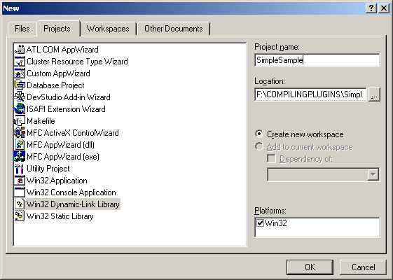
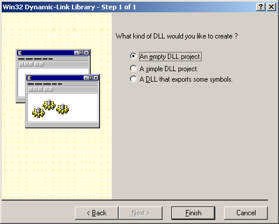
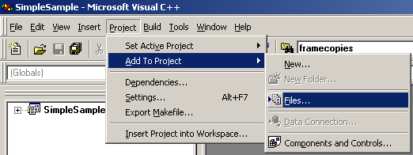
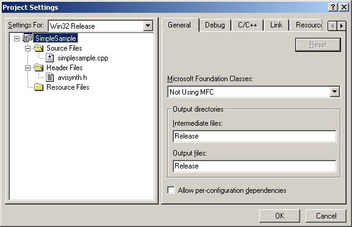
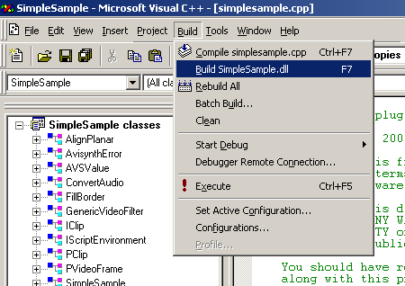

CompilingAviSynthPlugins
========================

.. toctree::
    :maxdepth: 3

.. contents:: Table of contents

.. _Introduction:

Introduction
------------

The Avisynth API is a C++ API, but that doesn't mean that you can use
every C++ compiler to compile your plugin. Unfortunately compilers have
different ideas about what the C++ ABI should look like. In practice,
this means that if you want things to work 100% as expected, you must
compile your plugin with the same compiler that was used to compile
AviSynth. That's MSVC 6.0 for official builds. Later versions of MSVC
will kinda sorta work, as will ICL (up to ICL10.1), but there are
caveats (for example, you must never allow any C++ exceptions to escape
your plugin ever - use ThrowError() instead - and you must always make
sure memory allocated by AviSynth is freed by AviSynth itself and not
by your plugin). So unfortunately it matters what C++ compiler will be
used to compile a plugin.

An application binary interface (`ABI`_) specifies how software
components should interact with each other at the binary level (in this
case AviSynth and a plugin). ABIs cover details such as the sizes,
layout, and alignment of data types, the calling convention of
functions' arguments that are passed and returned. It standardizes
details such as the `C++ name mangling`_ and exception propagation.
The problem is that there are different C++ ABIs.

Microsoft set their general C++ ABI with their first C++ compilers, and
it has had some changes along the years and versions of their compiler
suite. Intel and Borland, among others, support the Microsoft ABI, and
thus things built with the other generally work, just like with Linux
and the ABI used by GCC. Enter MinGW.

Instead of implementing the Microsoft ABI, the people at GCC and MinGW
decided to just use the same C++ ABI on Windows as they use everywhere
else. And thus we have two groups of compilers that use a different
ABI, and thus we have problems. If you try to load a mingw-built C++
API DLL from a MSVC-built Avisynth. The opposite will not work, either.
The C interface was made exactly for this reason, as pretty much by
chance the ABI for C is (more or less) set, and thus it is generally OK
to mix binaries created by different C compilers.

This is why the Avisynth C API exists: if you want a portable API, you
want a C API. C++ API's are more or less by definition unportable.

If you want extra reading regarding calling conventions and name
mangling and such ABI-related things, you can read the following PDF
that lists quite a few things of various implementations. Available
`here`_. Basically these things in general are not fixable by a mere
header, you would have to patch a compiler for the other calling
convention, as well as handle exceptions so that the other side would
understand it as well. And so forth, and so forth. (source: Doom9 forum
posts: `[1]`_, `[2]`_.)

.. _Compiling AviSynth Plugins step by step instructions (for MS VC++ 6.0):

Compiling AviSynth Plugins step by step instructions (for MS VC++ 6.0)
----------------------------------------------------------------------

Be sure to start with the :doc:`necessary software <SDKNecessaries>`.

Open VC++. Select a new project: Go to the File tab -> New. Select a Win32
Dynamic-Link Library in the Projects tab:

Add the location of your project and the Project Name. The location is the
project folder where the source of your project will be.

Select "An empty DLL project":

Copy existing source files (*.cpp), headers (*.h) and avisynth.h in your
project folder. If you started from scratch, you only need to copy avisynth.h
in your project folder.

Go to the Project tab -> Add To Project -> Files:

Add the existing source files (*.cpp), headers (*.h) and avisynth.h to your
project. If you start from scratch, you need to a new files to your project:

Go to the Project tab -> Add To project -> New:

| 1) Select C++ source file, and give it a name.
| 2) Select C/C++ header file (if you are going to use one), and give it a name.

Go to the Build tab -> Set Active Configuration -> select the release build.

If you go to the Project tab again -> Settings. Then you should see something
similar as this:

Save your workspace: File -> Save Workspace.

Finally, code your source/header files, and compile your plugin. Go to the
Build tab -> Build (...)

.. _How to debug AviSynth plugins:

How to debug AviSynth plugins
-----------------------------

Two ways are described to debug your plugin. An easy way using DebugView and
the use of VC++6's debugger. In both case, the sample code :doc:`SimpleSample v1.6 <SimpleSample16>` is used.

.. _How to debug AviSynth plugins (the short way):

How to debug AviSynth plugins (the short way)
~~~~~~~~~~~~~~~~~~~~~~~~~~~~~~~~~~~~~~~~~~~~~

An easy way to debug AviSynth plugin is to use a utility called `DebugView
for Windows`_ which captures OutputDebugString's output from your code
(OutputDebugString sends a string to your debugger). It's a bit limited. So,
if this is not sufficient, you should use a debugger as described in the next
section.

| 1) Open Dbgview.exe. Make sure that ``Capture Win32`` under the Capture tab is selected.

| 2) Add the following line at the start of your code:

::

    #include <stdio.h> /* for using sprintf */

Add, for example, the following lines in your code to check whether certain parameters are passed to the code path which comes after it:
::

    char BUF[256];
    sprintf(BUF, "framenr %d, text %s, height %d, pi %f\n", n, "hey",
    src_height, 3.14);
    OutputDebugString(BUF);

Thus:

.. image:: Pictures/debugging_plugins1a.png

::

    Nb, %d means integer, %s means string and %f means float/double. \n means add a new line.

| 3) Compile a release build of your plugin.

| 4) Open your script and scroll through it. You will see the following output in DebugView:

.. image:: Pictures/debugging_plugins1b.png

In the example the script is loaded in line 26. After that some AviSynth
output is captured. In the lines 57 and 58 the output of OutputDebugString is
written.

If your script crashes somewhere, you should put these lines just before the
crash (it may take a few attempts to find that point). Then you should pass
the values of the relevant parameters and check whether they are correct.
Apparently there is some parameter whose value is empty or invalid.

.. _How to debug Avisynth plugins (for MS VC++ 6.0):

How to debug Avisynth plugins (for MS VC++ 6.0)
~~~~~~~~~~~~~~~~~~~~~~~~~~~~~~~~~~~~~~~~~~~~~~~

These are the steps to debug an AviSynth plugin in VC++ 6:

| 1. Go to the build tab and set the Active configuration to the Debug version of your plugin.

| 2. Build the debug version of your plugin. Thus go to the build tab and ``Build (...)``.

| 3. We will use VirtualDub.exe to debug your plugin. Go to Project tab, then select Settings -> Debug -> General -> Executable for debug session -> browse to a version of VirtualDub.exe and specify that:

.. image:: Pictures/debugging_plugins2.png

| 4. Go to Project tab, then select Settings -> Debug -> Additional DLLs, and browse to the filter DLL in the Debug directory:

.. image:: Pictures/debugging_plugins3.png

| 5. Make an AviSynth script that loads and uses your filter. Make sure to load the Debug version of your plugin! Thus for example:

::

    LoadPlugin("F:\CompilingPlugins\SimpleSample\Debug\simplesample.dll")
    Colorbars().Trim(0,1)
    ConvertTORGB24()
    SimpleSample(100)

| 6. Set breakpoints as required. You can do this by clicking with the right mouse button next to a statement in your code (in the grey section). For example:

.. image:: Pictures/debugging_plugins4.png

Select the option: Insert/Remove Breakpoint:

.. image:: Pictures/debugging_plugins5.png

| 7. Go to the Build tab, and select Start Debug -> Go (or the shortcut F5). VirtualDub will execute. Open the AviSynth script in that VirtualDub instance. The code will execute up to your first breakpoint (at least if it follows that code path):

.. image:: Pictures/debugging_plugins6.png

You will see a yellow arrow through your breakpoint.

Above I also opened the 'variables output window'. It is under the View tab
-> Debug Windows -> Variables. You can view the value of the variables when
stepping through your code. Use Debug -> Step Into (or the shortcut F11) to
step through your code. Use Debug -> Step Over (or the shortcut F10) to step
over function calls.

When moving your mouse over a variable, you can also see the value of it:

.. image:: Pictures/debugging_plugins7.png

If you want to set a breakpoint somewhere else, just remove the existing one
(by right clicking on it). Put a new one somewhere and press F5.

If you want to stop debugging, go to the Debug tab -> Stop Debugging.

.. _Debug info from MAP file:

Debug info from MAP file
------------------------

IanB `wrote`_: Recent versions of Avisynth now ship with an avisynth.map! You
can use this accurately get routine addresses. Avisynth preferably loads at
0x10000000, use the debugger loaded module display to check this.

Build your plugin in debug mode. If you can, build yourself a Debug or Relsym
avisynth.dll and debug it, if not the use the .map file provided to
interprete the Call stack addresses.

.. _Compiling AviSynth Plugins step by step instructions (for MS VC++ 2005 Express Edition):

Compiling AviSynth Plugins step by step instructions (for MS VC++ 2005 Express Edition)
---------------------------------------------------------------------------------------

.. _Setup VC++ 2005 Express Edition environment:

Setup VC++ 2005 Express Edition environment
~~~~~~~~~~~~~~~~~~~~~~~~~~~~~~~~~~~~~~~~~~~

-   Install MS VC++ 2005 Express Edition.

| http://www.microsoft.com/express/2005/
| It is web-based install, but you need to register (which you can do freely).

| I prefer manual installation with full CD image download. It may be used on computer without Internet access.
| http://go.microsoft.com/fwlink/?linkid=57034

Run it at least once before installing the SDK

-   Install Microsoft Platform SDK

Last version is at http://www.microsoft.com/downloads/details.aspx?FamilyId=0BAF2B35-C656-4969-ACE8-E4C0C0716ADB

Previous versions works fine too (and older February 2003).

http://www.microsoft.com/msdownload/platformsdk/sdkupdate/

http://www.microsoft.com/msdownload/platformsdk/sdkupdate/psdk-full.htm

It seems, you need install Core component only with Web install, but you may
prefer full or ISO download for offline computer.

-   Update the Visual C++ directories in the Projects and Solutions
    section in the Options dialog box.

Add the paths to the appropriate subsection (change 'Microsoft Platform SDK
for Windows Server 2003 R2' in following strings by your real path of
installed version of Microsoft SDK):

Add to Executable files: ``C:\Program Files\Microsoft Platform SDK for Windows
Server 2003 R2\Bin``

Add to Include files: ``C:\Program Files\Microsoft Platform SDK for Windows
Server 2003 R2\Include``

Add to Library files: ``C:\Program Files\Microsoft Platform SDK for Windows
Server 2003 R2\Lib``

See http://msdn.microsoft.com/vstudio/express/visualc/usingpsdk/

-   Update the corewin_express.vsprops file.

To make the Win32 template work in Visual C++ Express you need to edit the
corewin_express.vsprops file (found in ``C:\Program Files\Microsoft Visual
Studio 8\VC\VCProjectDefaults``) and change the string that reads:

AdditionalDependencies="kernel32.lib" to

AdditionalDependencies="kernel32.lib user32.lib gdi32.lib winspool.lib
comdlg32.lib advapi32.lib shell32.lib ole32.lib oleaut32.lib uuid.lib"

This step is usually not needed for most AviSynth plugins (kernel.lib is
enough), but sometimes you may need in some other library, in particular
User.Lib for debug.

-   Enable Win32 Windows Application type in the Win32 Application
    Wizard.

To enable that type, you need to edit the file AppSettings.htm file located
in the folder ``%ProgramFiles%/Microsoft Visual Studio 8/VC/VCWizards/AppWiz/Generic/Application/html/1033/``.

In a text editor comment out lines 441 - 444 by putting a // in front of them
as shown here:

// WIN_APP.disabled = true;

// WIN_APP_LABEL.disabled = true;

// DLL_APP.disabled = true;

// DLL_APP_LABEL.disabled = true;

Save and close the file and open Visual C++ Express.

This step is optional if you have project file for plugin (new or old C++
version) and do not create new plugin from scratch.

.. _How to compile existant (old MS VC 6.0) plugin with MS VC++ 2005:

How to compile existant (old MS VC 6.0) plugin with MS VC++ 2005
~~~~~~~~~~~~~~~~~~~~~~~~~~~~~~~~~~~~~~~~~~~~~~~~~~~~~~~~~~~~~~~~

-   Start VC++ 2005, go to folder with old plugin (e.g. :doc:`SimpleSample <SimpleSample>`)
    unpacked zip file with full source codes and project files, and open
    plugin workspace file SimpleSample.dsw.

-   Agree in dialog to convert and open this project.

-   Go to menu Build -> Configuration Manager, Set active solution
    configuration to Release (or Debug if you want firsly debug it).

-   Go to Build -> Build Solution (F7) to compile and create
    SimpleSample.dll

-   If you get fatal error LNK1181: cannot open input file 'odbc32.lib',
    then go to menu Project -> SimpleSample Properties. Select Configuration
    Properties -> Linker -> Input -> Additional Dependencies, and remove
    extra unneeded libraries like odbc32.lib, odbccp32.lib.

-   Also check Linker -> Output File option there and set approriate
    pathname (or Inherit From Process default).

-   You can make some changes (edit) of source codes if you want.

-   Repeat command Build -> Build Solution (F7) to compile and create
    SimpleSample.dll

.. _How to create new plugin from scratch with MS VC++ 2005:

How to create new plugin from scratch with MS VC++ 2005
~~~~~~~~~~~~~~~~~~~~~~~~~~~~~~~~~~~~~~~~~~~~~~~~~~~~~~~

-   Start VC++2005.
-   Menu: fiIe -> Create new project.
-   Select Win32 console appication.
-   Enter name of your new project and press OK.
-   You will in Win32 Appcilation Wizard. Press Application Settings
    (left panel).
-   Select Application Type as DLL (but it may be console too).
-   At Additional options select "Empty project"
-   Copy files to project folder with Explorer.
-   Add header file avisynth.h to the project: Menu Project -> Add
    existent item. Also add existant (e.g. simplesample.cpp) or create new
    CPP files by Project -> Add new item.
-   Go to menu Build -> Configuration Manager, Set active solution
    configuration to Release (or Debug if you want firsly debug it).
-   Make some changes (edit) of source codes to implement your algorithm.
    See :doc:`SimpleSample <SimpleSample>` or some other open source plugin source code and
    Avisynth :doc:`FilterSDK <FilterSDK>` for details.
-   Go to Build -> Build Solution (F7) to compile and create plugin
    SimpleSample.dll

.. _Compiling AviSynth Plugins step by step instructions (for MS VC++ 2008 Professional Edition):

Compiling AviSynth Plugins step by step instructions (for MS VC++ 2008 Professional Edition)
--------------------------------------------------------------------------------------------

-   In this guide, we will compile the Example plugin from CPP for C
    programmers, from
    http://forum.doom9.org/showthread.php?p=1538557#post1538557 or
    directly from http://www.mediafire.com/download.php?tc61m9otustmy29
-   Start Microsoft Visual Studio 2008
-   Upon first start, you are asked to set up your environment. You may
    choose the typical Visual C++ option
-   Choose File->New->Project or click the New Project icon
-   On the left pane, under Project Types, expand Visual C++ and select
    Win32
-   On the right pane, choose Win32 Console Application
-   Enter a name for your project (in this example we will use Example),
    click OK
-   You may get an error: An error has occurred in this dialog, Error:
    54, Unspecified Error. This may be because you installed some windows
    updates but didn't reboot yet. Click OK.
-   You are shown the current project settings. Click Next.
-   Under Application Type, click the DLL option. Under Additional
    options, check the Empty project box.
-   A new directory is created, ``My Documents\Visual Studio
    2008\Projects\Example``
-   You need to extract the files from our example plugin into
    ``My Documents\Visual Studio 2008\Projects\Example\Example``
-   In the default layout, there is a Solution Explorer pane on the left
    side. Right click Header Files, and select Add->Existing Item, select
    avisynth.h and click Add
-   Continue to add the other files, Info.h and InfoF.h
-   Right click Source Files, select Add->Existing Item, and select
    Example.cpp
-   Click Build->Build Solution (this will give errors!)
-   There's a lot of errors about OutputDebugStringW. To fix this, select
    Project->Example Properties
-   In the left pane, Expand Configuration Properties, select General
-   In the right pane, click Character Set. Use the drop-down to select
    Use Multi-Byte Character Set. Click OK.
-   Click Build->Build Solution (this may give errors!)
-   In the version 0.3 of the plugin, there was an error,
    ``example.cpp(610) : error C4430: missing type specifier - int assumed``.
    To fix this, double-click that error line to highlight it's location in
    the example.cpp source file. Change ``const wstep = (vi.IsRGB24()) ? 3 :
    4; // 3 bytes for RGB24, & 4 for RGB32.`` to ``const int wstep =
    (vi.IsRGB24()) ? 3 : 4; // 3 bytes for RGB24, & 4 for RGB32.``
-   Click Build->Build Solution
-   If you get an error ``unresolved external symbol _main referenced in
    function ___tmainCRTStartup``, then you're trying to build an .exe. Use
    Project->Example Properties, Configuration Properties, General, set
    Configuration Type to Dynamic Library (.dll)
-   By default, a debug version is made. To change this,
    Build->Configuration Manager, select Release in the left drop-down
-   You will have to re-apply the configuration changes: Project->Example
    Properties, Configuration Properties, General, Configuration Type=Dynamic
    Library (.dll) and Character Set=Use Multi-Byte Character Set
-   The following file should appear: ``My Documents\Visual Studio
    2008\Projects\Example\Release\Example.dll``. Note that there is also a
    directory ``My Documents\Visual Studio
    2008\Projects\Example\Example\Release`` which contains only tempory files,
    but not the dll. This is set under Project->Example Properties, General,
    Output Directory=$(SolutionDir)$(ConfigurationName), Intermediate
    Directory=$(ConfigurationName). In this case ``$(SolutionDir)=My
    Documents\Visual Studio 2008\Projects\Example``,
    $(ConfigurationName)=Release.
-   You need to copy Example.dll to your Avisynth plugins directory, and
    then test it with the Example.avs file.
-   If everything worked, you can proceed to modify the example by
    following the comments, or also using the SimnpleSample included in the
    Avisynth distribution.

.. _Compiling AviSynth Plugins or Console Applications step by step instructions (for MS VC++ 2010 Express and Professional Edition):

Compiling AviSynth Plugins or Console Applications step by step instructions (for MS VC++ 2010 Express and Professional Edition)
--------------------------------------------------------------------------------------------------------------------------------

These instructions are also valid for the 2008 editions. Be sure to
start with the :doc:`necessary software <SDKNecessaries>`.

.. _Creating a new project:

Creating a new project
~~~~~~~~~~~~~~~~~~~~~~

Open MSVC++ 2010. Select a new project:

.. image:: Pictures/Compiling_plugins_msvc2010_001.jpg

Select a Win32 Console Application. Add the location of your project
and the project name. The Location\Name will be the project folder (or
Solution Directory as MSVC++ 2010 calls it) where the source of your
project will be. If the folder "Name" already exists the 'Create
directory for solution' box should be left unchecked, otherwise it will
create as a subfolder regardless.

.. image:: Pictures/Compiling_plugins_msvc2010_002.jpg

Select application settings. When creating a plugin check the
application type 'DLL' and when creating a console application (such as
avs2wav.exe for example) check the application type 'Console
application'. Also check the additional option 'Empty project' boxes.
Click on finish:

.. image:: Pictures/Compiling_plugins_msvc2010_003.jpg

In the Solution Explorer window, the solution has the 'folders'
External Dependencies, Header Files, Resource Files and Source Files:

.. image:: Pictures/Compiling_plugins_msvc2010_004.jpg

Copy existing source files (*.cpp), headers (*.h) and avisynth.h in
your project folder. If you started from scratch, you only need to copy
avisynth.h in your project folder.

You can add the source and header files to your project by
right-clicking on a 'folder' (say Header Files as in the screenshot
below), select Add and Existing Item (or New Item if you start from
scratch):

.. image:: Pictures/Compiling_plugins_msvc2010_005.jpg

Select the release build, since we are building the release build.

.. _General settings:

General settings
~~~~~~~~~~~~~~~~

If it's your first time you need to select the expert settings to make
the build tab visible:

Tools > Settings > Expert Settings

.. image:: Pictures/Compiling_plugins_msvc2010_006.jpg

In the property page you can see (and change) the location of the DLL
that will be build:

Right click on the project name (InvertNeg in our case) > Properties >
Configuration Properties > General

The default location is $(SolutionDir)$(Configuration)\. You have set
the 'SolutionDir' when defining the project
(``D:\AviSynth\Plugins|InvertNeg`` in our case). 'Configuration' will be
the Release or Debug folder depending on which configuration you have
selected.

.. image:: Pictures/Compiling_plugins_msvc2010_007.jpg

Next you need to be aware of the VC++ Directories and change them if
necessary:

Right click on the project name (InvertNeg in our case) > Properties >
Configuration Properties > VC++ Directories

Here you will find the location of the 'Include Directories' and
others. $(VCInstallDir)include points to the include folder of MSVC++
2010 and $(WindowsSdkDir)include to the include folder of the Microsoft
Platform SDK. When including headers (such as windows.h) in your
project they will be searched for in the include folders (unless you
explicitly add its location when including them). So both of them
should point to the correct folders.

Note that in general windows.h should be included in your project. It
is the header file for accessing the Win32 API through C/C++ and it is
located in the include folder of the Microsoft Platform SDK.

.. image:: Pictures/Compiling_plugins_msvc2010_008.jpg

You can see the values of VCInstallDir and WindowsSdkDir when opening
the VS command prompt:

Tools > Visual Studio > Command Prompt

The VS command prompt will be loaded. Type set and you will see the
variables. They will be set when starting MSVC++ 2010 (by vsvars32.bat
which is located in your ``<VisualStudioInstallDir>\Common7\Tools``
folder).

.. _Building the plugin or console application:

Building the plugin or console application
~~~~~~~~~~~~~~~~~~~~~~~~~~~~~~~~~~~~~~~~~~

Now you are ready to build you DLL/EXE. Go to

Build > Build Solution

And you will find your compiled plugin in the Location\Name\Folder.

.. image:: Pictures/Compiling_plugins_msvc2010_009.jpg

----

Back to :doc:`FilterSDK <FilterSDK>`

$Date: 2014/10/27 22:04:54 $

.. _DebugView for Windows:
    http://technet.microsoft.com/en-us/sysinternals/bb896647.aspx
.. _wrote:
    http://forum.doom9.org/showthread.php?p=1041578#post1041578
.. _ABI: http://en.wikipedia.org/wiki/Application_binary_interface
.. _C++ name mangling: http://en.wikipedia.org/wiki/Name_mangling#Name_mangling_in_C.2B.2B
.. _here: http://www.agner.org/optimize/calling_conventions.pdf
.. _[1]: http://forum.doom9.org/showthread.php?p=1653392#post1653392
.. _[2]: http://forum.doom9.org/showthread.php?p=1653737#post1653737
