Debugging instructions
======================

.. toctree::
    :maxdepth: 3

.. contents:: Table of contents

How to debug AviSynth
---------------------

xx

How to debug AviSynth plugins
-----------------------------

Two ways are described to debug your plugin. An easy way using
DebugView and the use of VC++6's debugger. In both cases, the sample
code :doc:`SimpleSample <SimpleSample>` is used.

How to debug AviSynth plugins (the short way)
^^^^^^^^^^^^^^^^^^^^^^^^^^^^^^^^^^^^^^^^^^^^^

An easy way to debug AviSynth plugin is to use a utility called
`DebugView`_ for Windows which captures OutputDebugString's output from
your code (OutputDebugString sends a string to your debugger). It's a
bit limited. So, if this is not sufficient, you should use a debugger
as described in the next section.

1) Open Dbgview.exe. Make sure that 'Capture Win32' under the Capture
tab is selected.

2) Add the following line at the start of your code:
::

    #include <stdio.h> /* for using sprintf */

Add, for example, the following lines in your code to check whether
certain parameters are passed to the code path which comes after it:
::

    char BUF[256];
    sprintf(BUF, "framenr %d, text %s, height %d, pi %f\n", n, "hey", src_height, 3.14);
    OutputDebugString(BUF);

Thus:

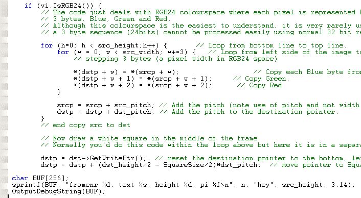

Nb, %d means integer, %s means string and %f means float/double. \n
means add a new line.

| 3) Compile a release build of your plugin.

4) Open your script and scroll through it. You will see the following
output in DebugView:

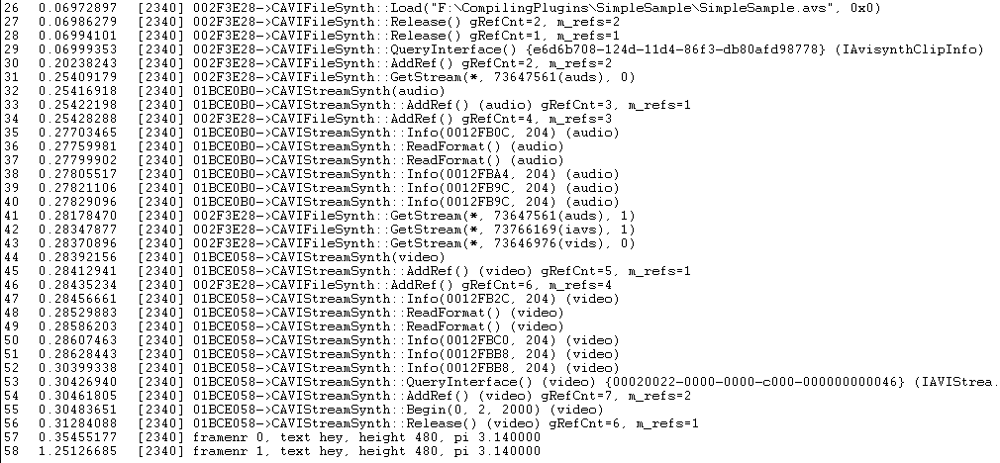

In the example the script is loaded in line 26. After that some
AviSynth output is captured. In the lines 57 and 58 the output of
OutputDebugString is written.

If your script crashes somewhere, you should put these lines just
before the crash (it may take a few attempts to find that point). Then
you should pass the values of the relevant parameters and check whether
they are correct. Apparently there is some parameter whose value is
empty or invalid.

How to debug Avisynth plugins (for MS VC++ 6.0)
^^^^^^^^^^^^^^^^^^^^^^^^^^^^^^^^^^^^^^^^^^^^^^^

These are the steps to debug an AviSynth plugin in VC++ 6:

1. Go to the build tab and set the Active configuration to the Debug
version of your plugin.

2. Build the debug version of your plugin. Thus go to the build tab and
Build (...).

3. We will use VirtualDub.exe to debug your plugin. Go to Project tab,
then select Settings -> Debug -> General -> Executable for debug
session -> browse to a version of VirtualDub.exe and specify that:

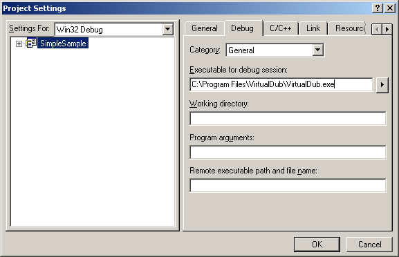

4. Go to Project tab, then select Settings -> Debug -> Additional DLLs,
and browse to the filter DLL in the Debug directory:

.. image:: Pictures/debugging_plugins3.png

5. Make an AviSynth script that loads and uses your filter. Make sure
to load the Debug version of your plugin! Thus for example:
::

    LoadPlugin("F:\CompilingPlugins\SimpleSample\Debug\simplesample.dll")
    Colorbars().Trim(0,1)
    ConvertTORGB24()
    SimpleSample(100)

6. Set breakpoints as required. You can do this by clicking with the
right mouse button next to a statement in your code (in the grey
section). For example:

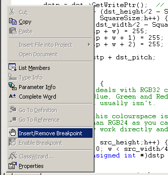

Select the option: Insert/Remove Breakpoint:

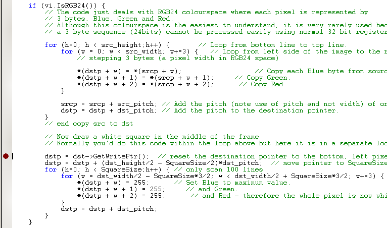

7. Go to the Build tab, and select Start Debug -> Go (or the shortcut
F5). VirtualDub will execute. Open the AviSynth script in that
VirtualDub instance. The code will execute up to your first breakpoint
(at least if it follows that code path):

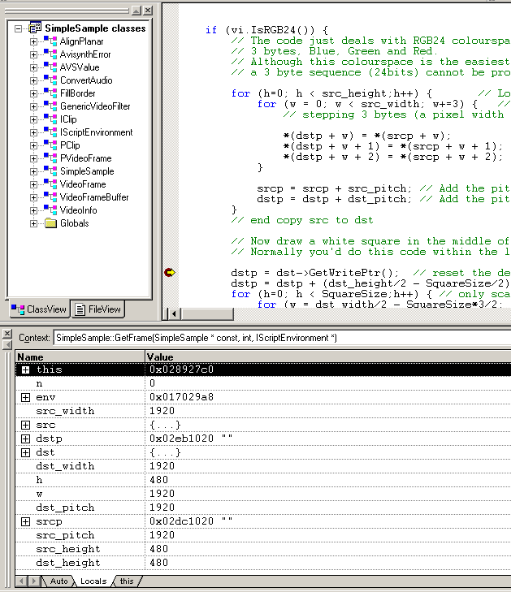

You will see a yellow arrow through your breakpoint.

Above I also opened the 'variables output window'. It is under the View
tab -> Debug Windows -> Variables. You can view the value of the
variables when stepping through your code. Use Debug -> Step Into (or
the shortcut F11) to step through your code. Use Debug -> Step Over (or
the shortcut F10) to step over function calls.

When moving your mouse over a variable, you can also see the value of
it:

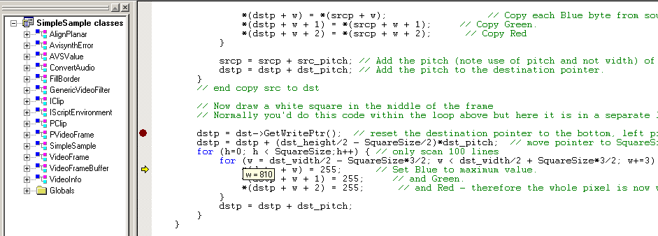

If you want to set a breakpoint somewhere else, just remove the
existing one (by right clicking on it). Put a new one somewhere and
press F5.

If you want to stop debugging, go to the Debug tab -> Stop Debugging.

How to debug Avisynth plugins (for MS VC++ 2010)
^^^^^^^^^^^^^^^^^^^^^^^^^^^^^^^^^^^^^^^^^^^^^^^^

Open your project. Select the debug build and build it. Make sure that
you load the debug build in your script.

Open Virtualdub and attach is to the debugger:

Debug > Attach to Process

.. image:: Pictures/Debugging_plugins_msvc2010_001.jpg

Select VirtualDub.exe and press attach:

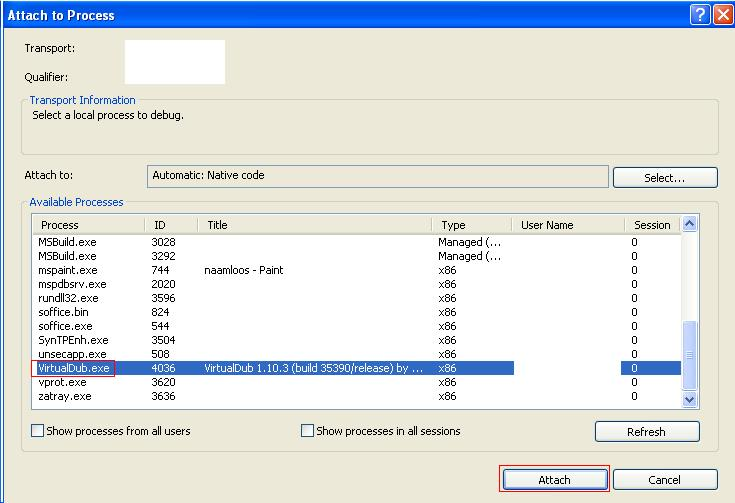

Set a breakpoint somewhere. You can do this by clicking with the right
mouse button next to a statement in your code (in the grey section):

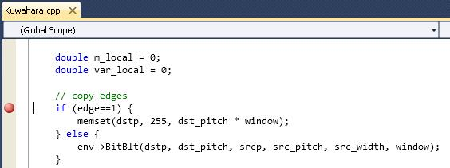

Open the script in Virtualdub and the code will be executed up to point
where you set the breakpoint.

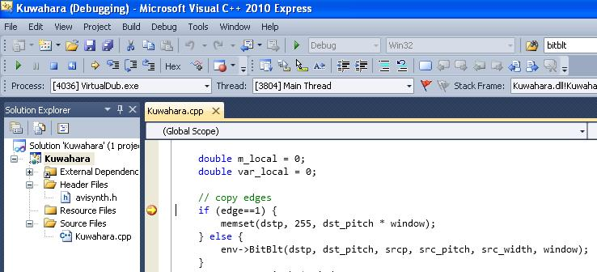

Instead of attaching Virtualdub to the debugger every time, you can
also do the following:

Right click on the project name (Kuwahara in our case) > Properties >
Configuration Properties > Debug

Enter the location of Virtualdub in the debug command:

.. image:: Pictures/Debugging_plugins_msvc2010_003.jpg

If you set a breakpoint somewhere and start the debugger:

Debug > Start Debugging

It will open Virtualdub and you can open your script to start the
debugging session.

How to debug Avisynth console applications (for MS VC++ 2010)
^^^^^^^^^^^^^^^^^^^^^^^^^^^^^^^^^^^^^^^^^^^^^^^^^^^^^^^^^^^^^

Open your project. Select the debug build and build it. Make sure that
you load the debug build in your script.

Right click on the project name (Kuwahara in our case) > Properties >
Configuration Properties > Debug

Enter the location of your console application and its arguments in the
debug command (in our case: avs2yuv.exe example.avs clip.raw):

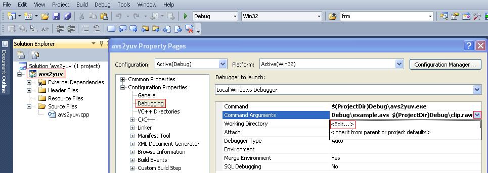

.. image:: Pictures/Debugging_con_applications_msvc2010_002.jpg

Set a breakpoint somewhere and start the debugger:

Debug > Start Debugging

It will open the command prompt and start the console application. The
script will be executed to start the debugging session.

Debug info from MAP file
------------------------

IanB `wrote`_: Recent versions of Avisynth now ship with an
avisynth.map! You can use this accurately get routine addresses.
Avisynth preferably loads at 0x10000000, use the debugger loaded module
display to check this.

Build your plugin in debug mode. If you can, build yourself a Debug or
Relsym avisynth.dll and debug it, if not the use the .map file provided
to interprete the Call stack addresses.

____

Back to :doc:`FilterSDK`

$Date: 2014/10/27 22:04:54 $

.. _DebugView: http://technet.microsoft.com/en-us/sysinternals/bb896647.aspx
.. _wrote: http://forum.doom9.org/showthread.php?p=1041578#post1041578
