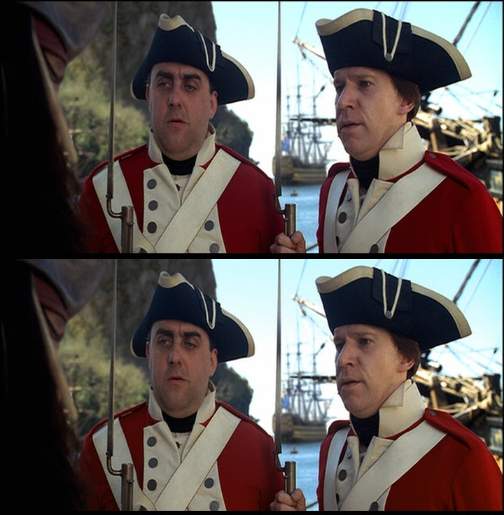

Colorimetry
===========

When playing back video content, several issues might go wrong. The levels
could be wrong, resulting in washed out colors (black is displayed as dark
gray and white is displayed as light gray). This is described in more detail
`here <http://avisynth.org/mediawiki/Luminance_levels>`_. The other issue is
a slight distortion in color (which often looks like a small change in
brightness) and this will be described here.

The problem could arise if your content is created in a different colorspace
as it is stored later on. Usually it is created in RGB, but stored as YCbCr.
Upon display it will be converted back again to RGB. This means that two
color conversions will take place. The problem is that there are different
ways of doing this conversion. If the two color conversions are not the same,
the displayed content won't be the same as the original content. There are
many other colorspaces, but they won't be discussed here. See for example
`this FAQ <http://www.poynton.com/notes/colour_and_gamma/ColorFAQ.html>`_.

So when converting YCbCr to RGB upon display, the correct color conversion
standard (Rec.601 or Rec.709) must be used, namely the one which was used
when storing the content. (Rec.709 and Rec.601 are short for ITU-R BT.709 and
ITU-R BT.601.)

----

.. toctree::
    :maxdepth: 3

.. contents:: Table of contents

What are color conversion standards?
------------------------------------

There are multiple ways of doing the YCbCr <-> RGB conversion. The general
conversion is given by

| ``Y = Kr*R + Kg*G + Kb*B``
| ``Cb = (B-Y)/(1-Kb)``
| ``Cr = (R-Y)/(1-Kr) = R - G * Kg/(1-Kr) - B * Kb/(1-Kr)``

and the other way around:

| ``R = Y + Cr*(1-Kr)``
| ``G = Y - Cb*(1-Kb)*Kb/Kg - Cr*(1-Kr)*Kr/Kg``
| ``B = Y + Cb*(1-Kb)``

with (0.0 <= [Y,R,G,B] <= 1.0) ; (-1.0 <= [Cb,Cr] <= 1.0) and Kr + Kg + Kb =
1.

The red, green and blue coefficients (Kr,Kg,Kb) are standardized in
specifications and there are several of them. Have a look at
:doc:`Color_conversions <color_conversions>` for examples.

How can I see if the correct standard is used upon playback?
------------------------------------------------------------

That's a tough question, because it's hardly possible to notice if the wrong
standard is used upon playback. In fact, it's hard to see any difference at
all between them. Take a look at the following screenshot:

The upper picture is shown correctly (using Rec.601), and for the lower one
the incorrect standard (Rec.709) is used upon playback. What you notice is
that the lower picture is more saturated (i.e. more colorful). But also that
the red is shifted a bit to yellow. [The other way around results in a less
saturated clip, red shifting towards magenta and blue shifting to cyan.]

So, how do you know then, which standard to choose upon playback? Well that's
not always possible, but you have to know the origin of your file. Also, in
some cases, that information can be stored in the header of the file. You
should stick to the following guideline:

**If your content is Standard Definition (SD) content use Rec.601 and if your
content is High Definition (HD) content use Rec.709, unless the header of the
content specifies otherwise.** I will elaborate on this in the following
sections.

Should I correct anything when processing my content?
-----------------------------------------------------

Yes, you should correct for it in some cases. It depends on your end format
and how it is played back. In general, it is save to assume that Rec.601 is
used for Standard Definition content and Rec.709 for High Definition content
upon playback. That means that often any specific header information
regarding colorimetry will be ignored. It will be assumed here that you are
processing with AviSynth.

Suppose you want to encode your content as Standard Definition content (that
is, height of the encoded video < 720p (720 vertical lines)). If you source
is MPEG-2 (then the colorimetry information can be stored in its header), get
the ColorMatrix plugin, and create the following script:
::

    # ColorMatrix does a Rec.709 -> Rec.601 conversion, if your source is Rec.709:
    DGDecode_mpeg2source("D:\source.d2v", info=3)
    ColorMatrix(hints=true, dest=2, interlace=false) # use interlace=true for interlaced content

Suppose you want to encode your content as High Definition content (that is,
height of the encoded video >= 720p). Create the following script:
::

    # ColorMatrix does a Rec.601 -> Rec.709 conversion, if your source is Rec.601:
    DGDecode_mpeg2source("D:\source.d2v", info=3)
    ColorMatrix(hints=true, dest=0, interlace=false) # use interlace=true for interlaced content

If the colorimetry information is not stored in the header (as with DivX/XviD
for example), it is not really possible to tell which colorimetry is used to
create it. All that you can do is assume Rec.601 is used for SD content and
Rec.709 is used for HD content, and hope that the assumption is correct. In
this case, you can't use the *hints* parameter of ColorMatrix, but you need
to give the conversion explicitly using the *mode* parameter.

How can I use the correct standard upon playback?
-------------------------------------------------

Whether this is possible (provided that the wrong standard is used upon play
back) depends on how your content is being played back. If you use a software
player you need to check whether it has an option to correct it. If you use a
directshow based player (such as WMP or MPC) there are different
possibilities which are explained below. If the renderer does the YCbCr->RGB
conversion, you should keep in mind that (as found are out in this
`thread`_):

-   Windowed/renderless VMR7 and VMR9 use BT.601 for video < 720p (720
    vertical lines)
-   Windowed/renderless VMR7 and VMR9 use BT.709 for video >= 720p (720
    vertical lines)

If you are using Haali's Video Renderer (get `Haali Media Splitter`_ in order
to install it) you can choose the color standard.

Have a look `at this thread <http://forum.doom9.org/showthread.php?t=134735>`_ for information about the different renderers.

Method #1: Adjusting graphics driver settings
~~~~~~~~~~~~~~~~~~~~~~~~~~~~~~~~~~~~~~~~~~~~~

I'm not sure whether this is possible. I need to ask someone ...

Method #2: Convert to RGB32 with ffdshow
~~~~~~~~~~~~~~~~~~~~~~~~~~~~~~~~~~~~~~~~

Forcing ffdshow to output RGB32 can help prevent colorimetry issues. Downside
of this method is that doing this conversion in software increases CPU usage.

To force RGB32 output in ffdshow, you should uncheck all colorspaces except
RGB32 on the Output page in ffdshow configuration. It is also recommended to
enable "High quality YV12 to RGB conversion". On the RGB conversion page, you
can choose which standard should be assumed, BT.601 or BT709. Choose the
first for SD material, and the latter for HD video.

Method #3: Pixelshader in Media Player Classic
~~~~~~~~~~~~~~~~~~~~~~~~~~~~~~~~~~~~~~~~~~~~~~

A pixelshader is a small program that runs on your graphics card and
processes some graphic data. In this case each frame of your video.

Media Player Classic has a shader called "BT.601 -> BT.709". A shader which
does the conversion the other way around is still not available. Use this
when needed.

Some requirements for the pixelshaders in MPC:

-   You need to use a compatible video renderer: VMR-7 (renderless),
    VMR-9 (renderless), or EVR Custom Presenter.
-   Surface setting must be set to "3D surfaces".
-   It requires some DirectX components that are not included with a
    default Windows installation. Run the DirectX Web Installer to get the
    required DirectX updates.

Method #4: Use AviSynth script in ffdshow video decoder
~~~~~~~~~~~~~~~~~~~~~~~~~~~~~~~~~~~~~~~~~~~~~~~~~~~~~~~

There are two ways to do this. The first one is to use the ColorMatrix
plugin, as explained in one of the previous sections, and the other one is to
convert to RGB using the appropriate matrix:

.. image:: pictures/ffdshow_avisynth2.jpg

Here ffdshow will convert your content to RGB using Rec.601.

What do the specifications say about which colorimetry is supported in a particular format?
-------------------------------------------------------------------------------------------

VCD/MPEG-1
~~~~~~~~~~

Part 2 of the MPEG-1 standard covers video and is defined in ISO/IEC-11172-2.
It is heavily based on H.261. The colorimetry information is not written into
the header.

DVD/MPEG-2
~~~~~~~~~~

The DVD specs are not publicly available for free, and I don't know people
who have read those specs. The DVD specs should be a subset of the MPEG-2
specs (yes I know, that's a big assumption), and the latter is available for
free. It says the following:

*The older 1995 MPEG-2 spec (ISO/IEC 13818-2: 1995 (E)) says*

"In the case that sequence_display_extension() is not present in the
bitstream or colour_description is zero the matrix coefficients are assumed
to be those corresponding to matrix_coefficients having the value 1." The
value 1 stands for "1 Recommendation ITU-R BT.709". Note that in 1995 the
first DVD titles came out, so when making those specs, the DVD didn't exist
yet. In 2000, the MPEG-2 specs have changed with respect to this:

*The newer `2000 MPEG-2 spec (ITU-T Rec.H262 (2000 E))`_ says*

"In the case that sequence_display_extension() is not present in the
bitstream or colour_description is zero the matrix coefficients are assumed
to be implicitly defined by the application." The matrix coefficients are
described in "Table 6-9 - Matrix Coefficients".

In other words if sequence_display_extension is not present, the colorimetry
can be anything.

The ATSC standard
~~~~~~~~~~~~~~~~~

*Just for kicks,* `ATSC standard on page 18`_ *talks about colorimetry and the
assumptions to make when 'sequence_display_extension' does not tell you what
to do*:

   "The values for color_primaries, transfer_characteristics, and
   matrix_coefficients shall be explicitly indicated in the
   sequence_display_extension. While all values for color_primaries,
   transfer_characteristics, and matrix_coefficients defined in Tables 6-7, 6-8,
   and 6-9 of ISO/IEC 13818-2 [16, 18] are allowed in the transmitted bit
   stream, it is noted that ITU-R BT.709 [27] and SMPTE 170M are the most likely
   to be in common use.

Note: Some previously-encoded legacy material may not have the colorimetry
(i.e., color_primaries, transfer_characteristics, and matrix_coefficients)
explicitly indicated in the sequence_display_extension, in which case the
colorimetry is most likely ITU-R BT.709 for all formats except those formats
with vertical_size_value = 480, which are most likely to have colorimetry
according to SMPTE 170M." *As noted by* `hkazemi <http://forum.doom9.org/showthread.php?p=1089854#post1089854>`_

MPEG-4/ASP
~~~~~~~~~~

The colorimetry information is not written into the header.

MPEG-4/AVC
~~~~~~~~~~

*ITU-T Rec. H.264 (2005)/Amd.1 (06/2006) says*

"When the matrix_coefficients syntax element is not present, the value of
matrix_coefficients shall be inferred to be equal to 2. That is: Image
characteristics are unknown or are determined by the application." The matrix
coefficients are described in "Table E-5 - Matrix coefficients".

Application defaults
~~~~~~~~~~~~~~~~~~~~

In `Video Mystified`_, the author Keith Jack gives the following table (as
noted by `ariga`_; see: Table 13.16. MPEG-2 matrix_coefficients Codewords.)
::

    Sequence Display Extension:

    Color_primaries
    This optional 8-bit codeword describes the chromaticity coordinates of the source
    primaries, as shown in table. If sequence_display_extension is not present, or
    color_description = 0, the indicated default value must be used. This information
    may be used to adjust the color processing after MPEG-2 decoding to compensate for
    the color primaries of the display.

     -----------------------------------------------------------------------------------
    |    Color Primaries     |    Code     |          Application Default               |
    |------------------------|-------------|--------------------------------------------|
    | forbidden              |  0000 0000  |                                            |
    | BT.709, SMPTE 274M     |  0000 0001  | MPEG-2, ATSC, DVB 25Hz HDTV, DVB 30Hz HDTV |
    | unspecified            |  0000 0010  |                                            |
    | reserved               |  0000 0011  |                                            |
    | BT.470 system M        |  0000 0100  | DVD-Video 30 Hz                            |
    | BT.470 system B, G, I  |  0000 0101  | DVD-Video 25 Hz, DVB 25Hz SDTV             |
    | SMPTE 170M             |  0000 0110  | DVD-Video 30 Hz, DVB 30Hz SDTV             |
    | SMPTE 240M             |  0000 0111  |                                            |
    | reserved               |  0000 1000  |                                            |
    | :                      |      :      |                                            |
    | reserved               |  1111 1111  |                                            |
     -----------------------------------------------------------------------------------

| `dragongodz`_ claims this table should be interpreted as follows:
| *Having finally heard back from a person who is in the professional encoder
  industry (no I will not say who), I have more reliable information.: "The
  table is actually the limitation of what you can use. In other words if you
  set the sequence_display_extension to Rec.709 for dvd it is illegal. That
  doesn't mean it will not play etc it just means that it is not supported and
  any player that strictly follows the specs is more likely just to ignore it
  as if no value was set at all."*

References
----------

-   `<http://forum.doom9.org/showthread.php?t=131169>`_
-   `<http://forum.doom9.org/showthread.php?t=133982>`_
-   `<http://forum.doom9.org/showthread.php?p=1089979>`_
-   `<http://forum.doom9.org/showthread.php?t=133982#post1090068>`_

$Date: 2010/04/04 16:46:38 $

.. _thread: http://forum.doom9.org/showthread.php?t=82217&page=24
.. _Haali Media Splitter: http://haali.cs.msu.ru/mkv/
.. _2000 MPEG-2 spec (ITU-T Rec.H262 (2000 E)):
    http://www.itu.int/rec/T-REC-H.262/en
.. _ATSC standard on page 18:
    http://www.atsc.org/standards/a_81.pdf
.. _Video Mystified: http://www.amazon.com/Video-Demystified-Keith-Jack/dp/187870723X
.. _ariga: http://forum.doom9.org/showthread.php?p=1075105#post1075105
.. _dragongodz: http://forum.doom9.org/showthread.php?p=1089979#post1089979
