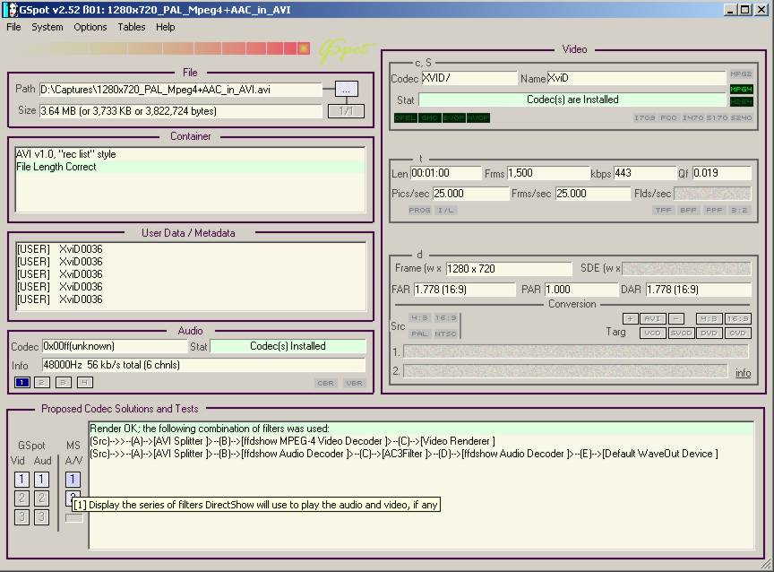
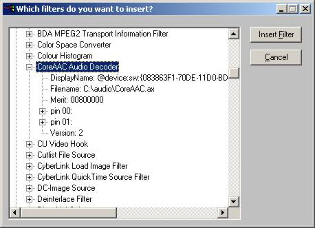
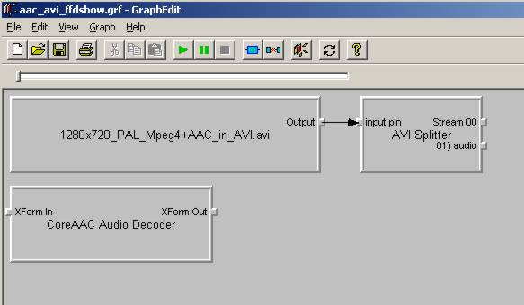
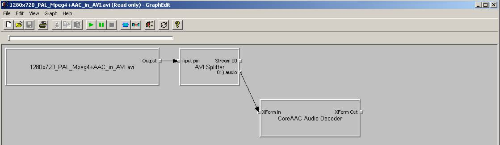
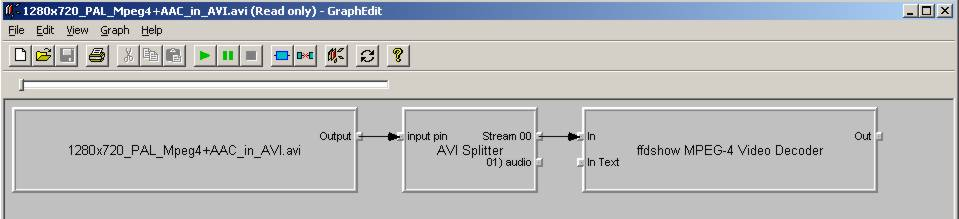

Importing media into AviSynth
=============================

.. toctree::
    :maxdepth: 3

.. contents:: Table of contents

Loading clips into AviSynth
---------------------------

Most video/audio formats can be loaded into AviSynth, but there are some
exceptions like swf video, flv4 (VP6) and dvr-ms. If it is not possible to
load a clip into AviSynth, you will have to convert it into some other format
which can be loaded. Remember to choose a format for which you will have a
minimal downgrade in quality as a result of the conversion.

In general there are two ways to load your video into AviSynth:

1.  using an AviSynth filter or plugin which is designed to open some
    specific format.
2.  using the :doc:`DirectShowSource <../corefilters/directshowsource>` plugin.

Make sure that your clip contains maximal one video and or one audio stream
(thus remove the subtitles and remove other video/audio streams). If you want
to load a clip which contains both video and audio, you have two options:

-   Demux the audio stream and load the streams separately in AviSynth.
-   Try to load the clip in AviSynth. This might or might not work. For
    AVIs, make sure you have a good AVI splitter installed [`Gabest AVI
    splitter`_]. (Yes, Windows comes with an own AVI splitter, which will
    work in most cases.)

When loading a clip into AviSynth it is adviced to follow the following
guidelines:

-   When it is possible to load your clip into AviSynth using either
    AviSource or a specific plugin then do so, since this is more reliable
    than the two alternatives which are listed below.
-   If the above fails, load your clip using the DirectShowSource plugin.
-   If the above fails, convert your clip into a different format (into
    one which is supported by AviSynth).

For many formats it is explained how to load them in AviSynth, but if your
format is not discussed here, there should be enough discussion of how to get
you starting. *There are often multiple ways to load your format into
AviSynth, so if one of them doesn't work, don't forget to try the other ones.
As an example, suppose you got an AVI with 5.1 DTS, but it doesn't open as
5.1 with AviSource. Try other ways, like opening it with DirectShowSource
(using AC3filter), or demux the audio and load the dts with NicAudio.*

Loading clips with video and audio into AviSynth
~~~~~~~~~~~~~~~~~~~~~~~~~~~~~~~~~~~~~~~~~~~~~~~~

AVI with audio
::::::::::::::

For loading your AVI with audio you need (1) a VfW (`Video for Windows`_)
codec to open (that is decode) your video in AviSynth and an ACM (`Audio
Compression Manager`_) codec to open your audio in AviSynth. For many video
and audio format such codecs are available, but certainly not for all of
them. Some possible formats (as well as where to download the required
codecs) are given below:

+---------+----------------------------------+
| Format  | ACM codec                        |
+=========+==================================+
| MP2     | `QDesign`_                       |
+---------+----------------------------------+
| MP3     | `Radium Codec`_ or `Lame ACM`_   |
+---------+----------------------------------+
| AC3     | `AC3 ACM codec`_                 |
+---------+----------------------------------+
| AC3/DTS | `AC3Filter`_ (The ACM codec      |
|         | used to return 2 channel output. |
|         | Dunno if that's still the case.) |
+---------+----------------------------------+
| AAC     | `AAC ACM Codec`_                 |
+---------+----------------------------------+
| FLAC    | `CoreFLAC ACM`_                  |
+---------+----------------------------------+

Examples:

::

    AviSource("d:\xvid_dts.avi")

Alternatively, use DirectShowSource with an AC3/DTS directshow filter like
`AC3Flter`_ (make sure that downmixing is turned off, unless you want it to
be downmixed or it is stereo/mono) and an `AVI-AC3/DTS splitter`_, or
ffdshow (with DTS set to libdts). Use AC3Filter and create the script:

::

    DirectShowSource("d:\xvid_dts.avi")

For AAC, use a directshow filter like CoreAAC (make sure downmixing is turned
off, unless you want it to be downmixed) or ffdshow (with AAC set to libfaad2
or realaac). We used ffdshow here:

.. image:: pictures/ffdshow_avi_aac.jpg

use the script

::

    DirectShowSource("d:\xvid_aac.avi")

to load your AVI.

The number of different video formats which can be found in an AVI is pretty
limited. A selection of them:

-   MPEG-4 ASP (install XviD or DivX to decode this format).
-   MPEG-4 AVC (to be more accurate; video encoded where a subset of the
    properties of MPEG-4 AVC has been used to create it can be placed into
    AVI; as far as I know there is no specific x264 VfW DEcoder so you need
    to open those files with DirectShowSource).
-   DV (install the `Cedocida codec`_ [`link to codec`_]).
-   MJPEG: as far as I know there is no free VfW MJPEG decoder (ffdshow
    can decode them though).
-   WMV (install the `WM9/VC-1 codecs`_).
-   `VP7`_.

.. _Other containers with audio:

Other containers with audio
:::::::::::::::::::::::::::

It is not always possible to load your clips in AviSynth using AviSource (or
one of the specific plugins which will be discussed below). Examples are non-
AVIs which are clips contained inside a different container, like MKV, MP4,
RMVB, OGM or ASF/WMV. In that case DirectShowSource is your last bet. It
might also be possible that you have an AVI, with an appropriate VfW codec
installed, but you want to use DirectShow codecs to open them in AviSynth. In
that case you should also use DirectShowSource.

When playing a clip in WMP6.4 (``mplayer2.exe``), DirectShow filters (``*.ax``) are
used to play it. Those are the same ones which are "used" by
DirectShowSource. So you need to be sure that you have the appropriate
DirectShow filters installed. To find out which filters are used to play the
clip, open the clip in WMP6.4 and check under: file -> properties ->
Advanced. Here you can also change the settings of the filters. You will get
more information about the filters when you open the clip in for example
`GSpot`_. Just open the clip and press "1" under A/V in the "Proposed Codec
Solutions and Tests" box. A "graph" is contructed which the filters which are
used to play it:

(In case you are wondering, due to my settings in AC3Filter it always shows
up in the filter chain. But in this example it shouldn't be loaded because it
doesn't support AAC.)

If you got the message "rendering failed (...)", it means that the
appropriate DirectShow filters are not installed. Make also sure the file is
playing correctly by pressing the "2" under the "1". Because if it is not
playing, DirectShowSource can't load the clip. In general, you can have the
following problem with this approach: **other DirectShow filters are used to
play the media file than the ones you installed or you want to use. This can
happen because the used filters have a higher merit (playing priority) than
the ones you want to use**. There are two solutions for this problem:

1.  change the merit of the used filter using `Radlight Filter Manager`_.
2.  use `GraphEdit (last post of the thread)`_ to contruct a graph using
    the DirectShow filters of your choice and load that graph with
    DirectShowSource.

This will be discussed in the sections ":ref:`Changing the merit of DirectShow
Filters <merit>`". and ":ref:`Using GraphEdit to make graphs of DirectShow filters and how
do I load these graphs in AviSynth <graphs>`".

Luckily you can install `ffdshow`_ (which comes with several DirectShow
decoders), which is able to decode many formats. For example:

-   MPEG1/2: enable mpeg1/2 by selecting the libavcodec or libmpeg2
    library:

.. image:: pictures/ffdshow_m2p.jpg

-   MJPEG in AVI: enable mjpeg by selecting the libavcodec library.
-   DV in AVI: enable DV by selecting the libavcodec library.
-   MPEG-4 ASP in OGM: xxx
-   MKV / MP4 / TS
-   h.264 in MKV/MP4: install xxx and use ffdshow
-   h.264 in TS: install Haali splitter and use ffdshow (or CoreAVC)
-   h.263 in FLV1: get the [`flv splitter`_] and enable h.263 playback by
    selecting the libavcodec library.

Example:

Load MP4 (video: h.264, audio: aac) using DirectShowSource and ffdshow (aac
decoding enabled in ffdshow; when the audio is AC3 or DTS you can also use
AC3Filter instead). Your script becomes for example:

::

    # adjust fps if necessary
    DirectShowSource("d:\x264_aac.mp4", fps=25, convertfps=true)

*some other formats:*

* RM/RMVB (RealMedia / RealMedia Variable Bitrate; usually containing Real
  Video/Audio): install the `rmvb splitter`_ and the Real codecs by installing
  RealPlayer/`RealAlternative`_. Create the script:

::

    # adjust fps if necessary
    DirectShowSource("d:\clip.rmvb", fps=25, convertfps=true)

* WMV/ASF (Windows Media Video / Advanced Systems Format; usually containing
  WMV/WMA): this format is not fully supported by ffdshow, so you will have to
  install wmv codecs. Get `WMF SDK v9 for W2K or later for XP/Vista`_ which
  contains the codecs (and the DMO wrappers necessary to use DMO filters in
  DirectShow). (Note that Microsoft's own VC1 codec is not supported in W2K
  since you need WMF SDK v11.) Create the script:

::

    # adjust fps if necessary
    DirectShowSource("d:\clip.wmv", fps=25, convertfps=true)

If the source material has variable framerate video, read this helpful
:doc:`guide <hybrid_video>`.

Loading video clips into AviSynth
~~~~~~~~~~~~~~~~~~~~~~~~~~~~~~~~~

As already explained, in general there are two ways to load your video into
AviSynth:

1.  using an AviSynth plugin which is designed to open some specific
    format.
2.  using the DirectShowSource plugin.

A list of all these plugins and their accepted formats is given below.

*1) AviSynth filters and plugins which are designed to open specific
formats:*

*AviSource - AVI/VDR:*

:doc:`AviSource <../corefilters/avisource>` supports all kind of AVIs with MP3 (VBR MP3) or AC3 audio. It
also supports DV type 1 and type 2, and VirtualDub frameserver files (VDR).

An AVI can be loaded in AviSynth provided you have an appropriate VfW codec
installed which can be used to decode the AVI. The default codec which is
used to decode the AVI is specified in the beginning of the media file (in
its header) itself as the FourCC (FOUR Character Code). From v2.55, an option
fourCC is added, which lets you use other codecs to load your AVI in
AviSynth.

A few examples:

::

    AviSource("d:\filename.avi")

or without the audio:

::

    AviSource("d:\filename.avi", false)

Forcing a decoder being used for loading the clip into AviSynth:

::

    # load your avi using the XviD codec:
    # opens an avi (for example DivX3) using the XviD Codec
    AviSource("d:\filename.avi", fourCC="XVID")

    # load your dv-avi using the Canopus DV Codec:
    AviSource("d:\filename.avi", fourCC="CDVC")

    # vdr-files (VirtualDub frameserver files):
    AviSource("d:\filename.vdr")

If AviSynth is complaining about not being able to load your avi  (couldn't
decompress ...) you need to install an appropriate codec. GSpot, for example,
will tell you what codec you need to install in order to be able to play your
avi.

*Mpeg2Source/DGDecode - MPEG1/MPEG2/VOB/TS/PVA:*

DGDecode (old version Mpeg2Dec3) is an external plugin and supports MPEG-1,
MPEG-2 / VOB, TS and PVA streams. Open them into DGIndex (or Dvd2avi
1.76/1.77.3 for Mpeg2Dec3) first and create a d2v script which can be opened
in AviSynth (note that it will only open the video into AviSynth):

A few examples:

::

    # old Mpeg2dec3; if you need a d2v script
    # which is created with dvd2avi 1.76/1.77.3
    LoadPlugin("d:\mpeg2dec3.dll")
    mpeg2source("d:\filename.d2v")

    # DGDecode:
    LoadPlugin("d:\dgecode.dll")
    mpeg2source("d:\filename.d2v")

Note that Mpeg2Dec3 is very limited compared to DGDecode, because it's
actually an old version of DGDecode and it only supports MPEG-2 / VOB.

*DGAVCDec - raw AVC/H.264 elementary streams* `[1]`_

DGAVCIndex: Index your raw AVC/H.264 stream.

Make an Avisynth script to frameserve the video:

::

    LoadPlugin("d:\DGAVCDecode.dll")
    AVCSource("d:\file.dga")

*RawSource - raw formats with/without header:*

The external plugin RawSource supports all kinds of raw video files with the
YUV4MPEG2 header and without header (video files which contains YUV2, YV16,
YV12, RGB or Y8 video data).

Examples:

::

    # This assumes there is a valid YUV4MPEG2-header inside:
    RawSource("d:\yuv4mpeg.yuv")

    # A raw file with RGBA data:
    RawSource("d:\src6_625.raw",720,576,"BGRA")

    # You can enter the byte positions of the video frames
    # directly (which can be found with yuvscan.exe).  This
    # is useful if it's not really raw video, but e.g.
    # uncompressed MOV files or a file with some kind of header:
    RawSource("d:\yuv.mov", 720, 576, "UYVY", \
        index="0:192512 1:1021952 25:21120512 50:42048512 75:62976512")

*QTSource (with QuickTime 6 or 7) and QTReader - MOV/QT:*

There are two ways to load your quicktime movies into AviSynth (and also
RawSource for uncompressed movs): QTSource and QTReader. The former one is
very recent and able to open many quicktime formats (with the possibility to
open them as YUY2), but you need to install QuickTime player in order to be
able to use this plugin. The latter one is very old, no installation of a
player is required in order to be able to open quicktime formats in AviSynth.

*QTSource:*

You will need Quicktime 6 for getting video only or Quicktime 7 for getting
audio and video.

::

    # YUY2 (default):
    QTInput("FileName.mov", color=2)

    # with audio (in many cases possible with QuickTime 7)
    QTInput("FileName.mov", color=2, audio=1)

    # raw (with for example a YUYV format):
    QTInput("FileName.mov", color=2, mode=1, raw="yuyv")

    # dither = 1; converts raw 10bit to 8bit video (v210 = 10bit uyvy):
    QTInput("FileName.mov", color=2, dither=1, raw="v210")

*QTReader:*

::

    # If that doesn't work, or you don't have QuickTime,
    # download the QTReader plugin (can be found in
    # Dooms download section):
    LoadVFAPIPlugin("C:\QTReader\QTReader.vfp", "QTReader")
    QTReader("C:\quicktime.mov")

*Import filter - AviSynth scripts:*

Just import the script using :doc:`Import <../corefilters/import>` at the beginning of your script:

::

    Import("d:\filename.avs")

In v2.05 or more recent version you can use the autoplugin loading. Just move
your AVS-file in the plugin folder containing the other (external) plugins,
and rename the extension to 'avsi'. See also :doc:`FAQ <../faq/faq_sections>` for more discussion.

*2) DirectShowSource:*

Have a look at section ":ref:`Other containers with audio`"
for more information.

Loading audio clips into AviSynth
~~~~~~~~~~~~~~~~~~~~~~~~~~~~~~~~~

Most audio formats can be loaded in AviSynth, but there are some exceptions
like MPL or multichannel WMA using W98/W2K. If it is not possible to load a
clip in AviSynth, you will have to convert it to some other format which can
be loaded. Remember to choose a format for which you will have a minimal
downgrade in quality as a result of the conversion.

In general there are two ways to load your audio into AviSynth:

1.  using an AviSynth plugin which is designed to open some specific
    format.
2.  using the DirectShowSource plugin.

A list of all these plugins and their accepted formats are given below, but
it is advised to load your clips using a specific format plugin (thus option
(1)), because it is more reliable than using the DirectShowSource plugin.

AviSynth filters and plugins which are designed to open specific formats
::::::::::::::::::::::::::::::::::::::::::::::::::::::::::::::::::::::::

WavSource - WAV
...............

:doc:`WavSource <../corefilters/avisource>` supports all kind of WAVs, such as uncompressed WAV or
MP3/MP3/AC3/DTS audio with a WAVE header. A WAV can be loaded in AviSynth
provided you have an appropriate `ACM codec`_ installed which can be used to
decode the WAV. The default codec which is used to decode the WAV is
specified in the beginning of the media file (in its header; a bit similar as
fourCC for video codecs).

Audio: MP2/MP3 with a WAVE header
.................................

There is an ACM codec for MP2 called [`QDesign`_]. There are  ACM codecs for
MP3 [`Radium Codec`_] or [`Lame ACM`_].

Audio: AC3/DTS with a WAVE header (also called DD-AC3 and DTSWAV)
.................................................................

There is an ACM codec for AC3 called [`AC3 ACM codec`_]. There is an ACM
codec for AC3/DTS called [`AC3Filter`_].

Example:

::

    # DTS in WAV:
    V = BlankClip(height=576, width=720, fps=25)
    A = WAVSource("D:\audio_dts.wav")
    AudioDub(V, A)

or if you have WinDVD platinum, install `hypercube's DTSWAV filter`_.

MPASource - MP1/MP2/MP3/MPA
...........................

Example:

::

    LoadPlugin("C:\Program Files\AviSynth25\plugins\mpasource.dll")
    V = BlankClip(height=576, width=720, fps=25)
    A = MPASource("D:\audio.mp3", normalize = false)
    AudioDub(V, A)

NicAudio - MP1/MP2/MP3/MPA/AC3/DTS/LPCM
.......................................

Some examples:

::

    LoadPlugin("C:\Program Files\AviSynth25\plugins\NicAudio.dll")

    # AC3 audio:
    V = BlankClip(height=576, width=720, fps=25)
    A = NicAC3Source("D:\audio.AC3")
    #A = NicAC3Source("D:\audio.AC3", downmix=2) # downmix to stereo
    AudioDub(V, A)

    # LPCM audio (48 kHz, 16 bit and stereo):
    V = BlankClip(height=576, width=720, fps=25)
    A = NicLPCMSource("D:\audio.lpcm", 48000, 16, 2)
    AudioDub(V, A)

BassAudio - MP3/MP2/MP1/OGG/WAV/AIFF/WMA/FLAC/WavPack/Speex/Musepack/AAC/M4A/APE/CDA
....................................................................................

BassAudio can be downloaded `from here`_. Some examples:

::

    # FLAC files:
    bassAudioSource("C:\ab\Dido\001 Here With Me.flc")

    # OGG files:
    bassAudioSource("C:\ab\Dido\001 Here With Me.ogg")

    # AAC files:
    bassAudioSource("C:\ab\Dido\001 Here With Me.aac")

    # Audio-CD Ripping using this plugin
    # Download BASSCD 2.2 from official BASS homepage
    # Extract basscd.dll and rename it to bass_cd.dll
    # Place bass_cd.dll in the same folder as bassAudio.dll
    bassAudioSource("D:\Track01.cda")

DirectShowSource
::::::::::::::::

Have a look at section "`Other containers with audio`_" for more
information. Some directshow filters (besides the ones available in ffdshow)
for Ogg Vorbis, Speex, Theora and FLAC can be found `here`_.

Audio: MP2/MP3 with a WAVE header
.................................

Use ffdshow: MP1/2/3 decoding enabled and select mp3lib or libmad.

Audio: AC3/DTS with a WAVE header (also called DD-AC3 and DTSWAV)
.................................................................

Use ffdshow: DTS decoding enabled and uncompressed: support all formats.

Example:

::

    # DTS in WAV:
    V = BlankClip(height=576, width=720, fps=25)
    A = DirectShowSource("D:\audio_dts.wav")
    AudioDub(V, A)

or making a graph:

::

    # DTS in WAV:
    # use WAVE parser and ffdshow or AC3filter: [add screenshots]
    V = BlankClip(height=576, width=720, fps=25)
    A = DirectShowSource("D:\audio_dts_wav.grf", video=false)
    AudioDub(V, A)

AAC
...

Get an AAC directshow filter like CoreAAC (make sure downmixing is turned
off, unless you want it to be downmixed;) or ffdshow (with AAC set to libfaad
or realaac), and use

::

    DirectShowSource("d:\audio.aac")

to load your AAC. You might need an AAC parser filter for DirectShow. Get one
here `[2]`_.

Loading images into AviSynth
~~~~~~~~~~~~~~~~~~~~~~~~~~~~

1) Use ImageReader or ImageSource to load your pictures into AviSynth
   (can load the most popular formats, except GIF and animated formats). See
   :doc:`internal documentation <../corefilters/imagesource>` for information.

2) Use the Immaavs plugin for GIF, animated formats and other type of
   pictures.

::

    # single picture:
    immareadpic("x:\path\pic.bmp")

    # animated gif:
    immareadanim("x:\path\anim.gif")

.. _merit:

Changing the merit of DirectShow Filters
----------------------------------------

Open Radlight Filter Manager and check which of the filters which can be used
to play your clip has a higher merit. Change the merit of the filter you want
to use for playback, for example:

.. image:: pictures/filtermanager_ac3.jpg

and restart your PC. In my experience this won't always work. In AC3Filter,
for example, there is setting called 'Filter Merit" which is set to 'Prefer
AC3Filter' by default. Although in my case the merit for AC3Filter was set
lower than the merit for Moonlight Odio Dekoda (MERIT_NORMAL versus
MERIT_NORMAL+1), the former was used to play my AC3 (I assume as a result of
that 'Prefer AC3Filter' setting in AC3Filter; setting it to 'Prefer other
decoder' solves this problem). Other filters might have such settings too.

.. _graphs:

Using GraphEdit to make graphs of DirectShow filters and loading these graphs in AviSynth
-----------------------------------------------------------------------------------------

As an example it will be shown how to make a graph where CoreAAC Audio
Decoder will be used to render the audio in an AVI-AAC file. More accurately
it will be shown how the ffdshow Audio decoder should be replaced by the
CoreAAC Audio Decoder, where the former has a higher merit (which implies
that filter will be used when playing the clip in a DirectShow based player
like WMP6.4 or when opening the AVI directly in AviSynth by using
DirectShowSource):

Open GraphEdit and open your clip: File tab -> Open Graph -> Select All Files
-> open your clip:

.. image:: pictures/directshow_avi_aac2.jpg

Right-click on the filter (ffdshow Audio decoder) -> Filter Properties ->
change settings if necessary.

Graph tab -> Insert Filters -> under DirectShow Filters -> select CoreAAC
Audio Decoder:

Press Insert Filter. Remove the ffdshow Audio decoder by selecting it and
pressing Delete:

Finally, connect the CoreAAC Audio Decoder, by connecting the pins with your
left mouse button (arrows will be drawn automatically):

.. image:: pictures/directshow_avi_aac5.jpg

Check and adjust the Filter Properties if necessary. Press play to check that
the clip is playable by the selected combation of DirectShow filters. This is
very important, because if it's not playable, AviSynth will not be able to
open the clip. In that case you should select and or install other filters
which can play the clip.

Finally remove the WaveOut Device and the video filters, because AviSynth
needs a free pin to connect itself when DirectShowSource is called in a
script.

Save the graph as audio.grf. If you want to load the video too in AviSynth,
it should be loaded separetely, using a different graph (where the audio part
and the Video Renderer is removed):

Save the graph as video.grf. Your script becomes:

::

    # change fps if necessary
    vid = DirectShowSource("D:\video.grf",\
                  fps=25, convertfps=true, audio=false)
    aud = DirectShowSource("D:\audio.grf", video=false)
    AudioDub(vid, aud)

To Do
-----

-   The following should be added: tpr, aup, RaWav (>4 GB WAVE files),
    ffmpegsource,
-   :ref:`How do I load MP4/MKV/M2TS/EVO into AviSynth`
-   swf (ffmpegsource) should be added.

$Date: 2013/03/19 18:10:47 $

.. _Gabest AVI splitter:
    http://sourceforge.net/project/showfiles.php?group_id=82303
.. _Video for Windows: http://en.wikipedia.org/wiki/Video_for_Windows
.. _Audio Compression Manager:
    http://en.wikipedia.org/wiki/Audio_Compression_Manager
.. _QDesign: http://www.wilbertdijkhof.com/qmpeg_mp2.zip
.. _Radium Codec: http://www.free-codecs.com/MPEG_Layer_3_Codec_download.htm
.. _Lame ACM: http://www.free-codecs.com/LAME_ACM_Codec_download.htm
.. _AC3 ACM codec: http://fcchandler.home.comcast.net/~fcchandler/AC3ACM/
.. _AC3Filter: http://ac3filter.net/wiki/Download_AC3Filter
.. _AAC ACM Codec: http://fcchandler.home.comcast.net/~fcchandler/AACACM/
.. _CoreFLAC ACM: http://www.jorystone.com/2004/09/flac-acm.html
.. _AC3Flter: http://sourceforge.net/project/showfiles.php?group_id=66022
.. _AVI-AC3/DTS splitter: http://sourceforge.net/project/showfiles.php?group_id=82303
.. _Cedocida codec: http://www-user.rhrk.uni-kl.de/~dittrich/cedocida/index.html
.. _link to codec: http://forum.doom9.org/showthread.php?t=94458
.. _WM9/VC-1 codecs: http://nic.dnsalias.com/wm9enc.html
.. _VP7: http://forum.doom9.org/showthread.php?t=97877
.. _GSpot: http://www.headbands.com/gspot/
.. _Radlight Filter Manager: http://www.free-codecs.com/download/RadLight_Filter_Manager.htm
.. _GraphEdit (last post of the thread):
    http://forum.doom9.org/showthread.php?t=104234
.. _ffdshow: http://sourceforge.net/project/showfiles.php?group_id=173941
.. _flv splitter: http://sourceforge.net/project/showfiles.php?group_id=82303
.. _rmvb splitter: http://sourceforge.net/projects/guliverkli/
.. _RealAlternative: http://www.free-codecs.com/download/Real_Alternative.htm
.. _WMF SDK v9 for W2K or later for XP/Vista:
    http://msdn.microsoft.com/windowsmedia/downloads/default.aspx
.. _[1]: http://neuron2.net/dgavcdec/dgavcdec.html
.. _ACM codec:
    http://en.wikipedia.org/wiki/Audio_Compression_Manager
.. _hypercube's DTSWAV filter:
    http://forum.doom9.org/showthread.php?s=&threadid=52692
.. _from here: http://forum.doom9.org/showthread.php?t=108254
.. _here: http://www.illiminable.com/ogg/
.. _[2]: http://www.rarewares.org/aac-decoders.php#aac_parser
