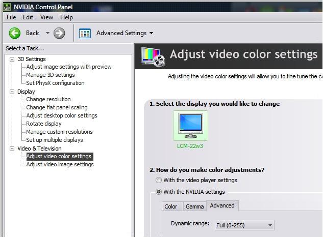

Luminance levels
================

Wrong levels is a common playback problem. It is a subject that gets
discussed over and over again. The purpose of this topic is to centralize the
collective knowledge of the Doom9 community regarding this subject. Everyone
please share your knowledge. I'll update the information below to include
your wisdom.

.. toctree::
    :maxdepth: 3

.. contents:: Table of contents

What are luminance levels?
--------------------------

Digital video is typically encoded in a YCbCr format. YCbCr is a family of
color spaces (YV12, YUY2, etc), that encode color information (chroma)
separately from brightness information (luma).

There are two standards for the encoding of luminance. For standard-
definition TV (SDTV) the standard is BT.601, and for high-definition TV
(HDTV) the standard is BT.709.

Luma values fall in a range. Unfortunately this range is not always the same.
There are two commonly used ranges: 0-255 (aka PC levels) and 16-235 (aka TV
levels). 'TV levels' were originally created to allow for analog overshoot
and undershoot `[1]`_. This holds for both the YCbCr and the RGB format.
Usually, your video is stored in 16-235 YCbCr, but it is played back at 0-255
RGB. This implies that the levels need to be expanded at some point. But in
some cases your video will be stored as 0-255 YCbCr (DV is an example of
this), and no expansion is needed.

Thus when converting a YCbCr colorspace to RGB, the correct standard (BT.601
or BT.709) must be used and the correct range (TV or PC levels) must be used.

The above is not always done correctly. It can go wrong with certain
combinations of video renderers, video resolutions and graphics driver
settings.

How can I see if the levels are wrong?
--------------------------------------

The video looks washed out and the colors are not vivid. Black is displayed
as dark gray. White is displayed as light gray.

The opposite is also possible, but more rare. In that case dark colors are
displayed too dark, and light colors are displayed too bright.

Which combinations give wrong levels?
-------------------------------------

Many factors play a role, so it is not possible to give a list of
combinations that always gives wrong levels for everyone. Below is an
(incomplete) list of situations in which wrong levels are likely to occur
(when outputting to a PC monitor). This means they will convert YCbCr
[16,235] to RGB [16,235] (so the levels are not expanded). But in general,
just trust your eyes.

-   Windows Vista + EVR CP + SD video + ATI
-   Windows Vista + EVR CP + SD video + NVIDIA
-   Windows XP + VMR-7 (renderless) + SD video + ATI
-   Windows XP + VMR-9 (windowed) + SD video + ATI
-   Windows XP + VMR-9 (renderless) + SD video + ATI
-   Windows XP + EVR + SD video + ATI
-   Windows XP + EVR CP + SD video + ATI

(if you have additions to this list, then please post them)

How can I correct the levels?
-----------------------------

The methods below assume that you are outputting the video (stored as 16-235
YCbCr) to a PC monitor or LCD TV, meaning a device that needs full range RGB
(0-255). If you are using a CRT TV, then read the comments at methods 2 and
3.

Method #1: Adjusting graphics driver settings
~~~~~~~~~~~~~~~~~~~~~~~~~~~~~~~~~~~~~~~~~~~~~

**NVIDIA**

Since version 177.84, the NVIDIA drivers have an option for configuring the
luma range.

You can find the option here: NVIDIA Control Panel -> Video & Television ->
Adjust video color settings -> Select "With the NVIDIA settings" -> Advanced
tab -> Set Dynamic Range to "Full (0-255)".

**ATI**

The ATI driver requires a Registry tweak. With the tweak applied, the driver
will convert TV levels to PC levels for SD resolution video. It already does
that by default for HD video.

ToDo: include idiot proof solution for applying the tweak

Several ATI driver tweaks can be found `in this thread`_. The UseBT601CSC setting is
the one related to luminance levels.

Method #2: Convert to RGB32 with ffdshow
~~~~~~~~~~~~~~~~~~~~~~~~~~~~~~~~~~~~~~~~

Forcing ffdshow to output RGB32 can help prevent luminance level issues.
Downside of this method is that doing this conversion in software increases
CPU usage.

To force RGB32 output in ffdshow, you should uncheck all colorspaces except
RGB32 on the Output page in ffdshow configuration. It is also recommended to
enable "High quality YV12 to RGB conversion". On the RGB conversion page, you
can choose which standard should be assumed, BT.601 or BT709. Choose the
first for low resolution material, and the latter for HD video.

Note: an automatic selection option based on the video resolution will
hopefully be added in the near future.

Tip: the Profiles/Presets feature in ffdshow can be used to create different
sets of settings. You can even auto-load profiles based on conditions like
resolution of video format. You could for example create a profile
specifically for HD resolution video, and use the 'standard' profile for low
resolution videos.

Note: When outputting to a CRT TV, you need to select "Full Range" contrast.
For PC monitors and LCD TVs, the default "Standard" contrast setting is
correct.

Method #3: Levels filter in ffdshow video decoder
~~~~~~~~~~~~~~~~~~~~~~~~~~~~~~~~~~~~~~~~~~~~~~~~~

ffdshow has a special filter for adjusting (luminance) levels. To correct
wrong luminance levels for a PC monitor or LCD TV you usually need to convert
to PC levels. To correct wrong levels for a CRT TV, you usually need to
convert to TV levels.

To convert from TV levels to PC levels use 16-235 as input range and 0-255 as
output range. To convert from PC levels to TV levels use 0-255 as input range
and 16-235 as output range.

Method #4: Pixelshader in Media Player Classic
~~~~~~~~~~~~~~~~~~~~~~~~~~~~~~~~~~~~~~~~~~~~~~

A pixelshader is a small program that runs on your graphics card and
processes some graphic data. In this case each frame of your video.

Media Player Classic has a special pixelshader called "16-235 -> 0-255" for
converting TV levels to PC levels. This shader only adjusts luma values.
There also is a shader called "BT.601 -> BT.709". That one is more advanced
and also adjust chroma values.

Note: the current shaders in MPC always behave the same, regardless of the
video resolution. Since wrong levels may not occur at all resolutions, it is
not recommended to have the shaders enabled all the time. Adjusting levels
when no adjustment is needed will lead to suboptimal results.

Some requirements for the pixelshaders in MPC:

-   You need to use a compatible video renderer: VMR-7 (renderless),
    VMR-9 (renderless), or EVR Custom Presenter.
-   Surface setting must be set to "3D surfaces".
-   It requires some DirectX components that are not included with a
    default Windows installation. Run the DirectX Web Installer to get the
    required DirectX updates.

Method #5: Use AviSynth script in ffdshow video decoder
~~~~~~~~~~~~~~~~~~~~~~~~~~~~~~~~~~~~~~~~~~~~~~~~~~~~~~~

Adjusting levels or conversion to RGB32 can also be done through an AviSynth
script in ffdshow. This is for advanced users.

If your video is stored as 16-235 YCbCr, open the video decoder tab of
ffdshow (here this is done for MPC):

.. image:: pictures/ffdshow_avisynth.jpg

Check the AviSynth box, and create the following script

.. image:: pictures/ffdshow_avisynth2.jpg

ffdshow will add itself as source. More information can be found `here`_.

If your video is stored as 0-255 YCbCr, create the following script:

::

    ConvertToRGB(matrix="PC.601") # keep full range video (use matrix="PC.709" when appropriate)

If your video is stored as 0-255 YCbCr and you want to pass 16-235 YCbCr to
your renderer, use

::

    ColorYUV(levels="PC->TV") # convert to TV-levels

Method #6: Monitor settings
~~~~~~~~~~~~~~~~~~~~~~~~~~~

Some monitors can be calibrated to assume a certain luminance level as input.

Method #7: Resize in software
~~~~~~~~~~~~~~~~~~~~~~~~~~~~~

If wrong levels occur only with SD video resolutions and not with high
resolutions, then another solution would be to resize the video in software.
For example ffdshow can be used for resizing the video.

Test files
----------

Here are some nice test clips to test your setup: `Test clips`_ (thanks to
littleD for making them).

*Thanks `clsid`_ for writing this great article.*

$Date: 2013/03/19 18:10:47 $

.. _[1]: http://en.wikipedia.org/wiki/Rec._601
.. _in this thread: http://www.avsforum.com/avs-vb/showpost.php?p=11622510&postcount=2011
.. _here: http://ffdshow-tryout.sourceforge.net/wiki/video:avisynth
.. _Test clips:
    http://forum.doom9.org/showthread.php?p=1230259#post1230259
.. _clsid: http://forum.doom9.org/showthread.php?t=143689
