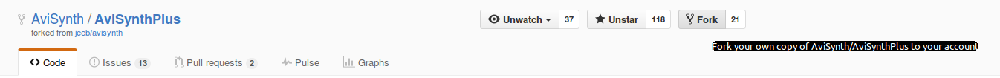
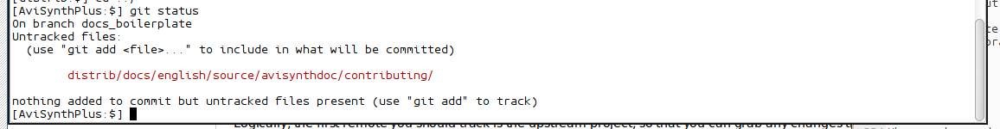
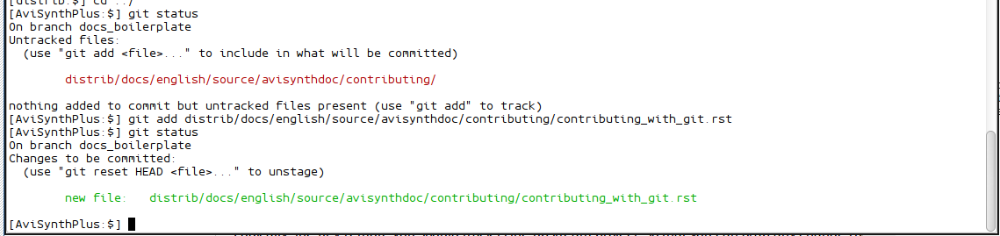
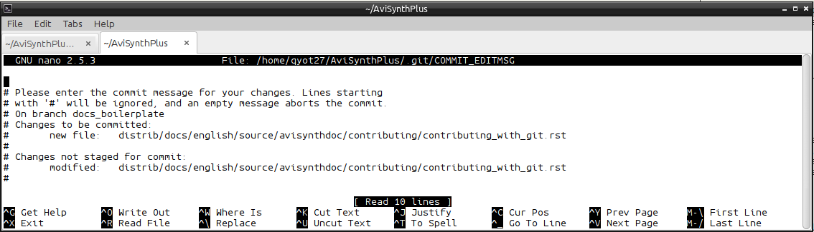
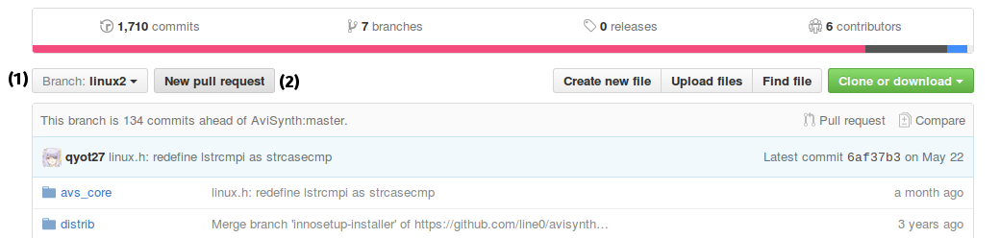

Contributing to AviSynth+
=========================

AviSynth+ uses `git`_ as its distributed version control system (DVCS) of choice.
This document is intended as a basic primer to help users unfamiliar with git,
whether they have previously contributed to classic AviSynth (which uses the
Concurrent Versions System, a.k.a. CVS), or are completely new to the project.
It is not intended as a thorough treatment of any of these commands.  For that,
you can refer to the `Pro Git book`_.

.. toctree::
    :maxdepth: 3

.. contents:: Table of contents

Installing git
--------------

How to install git varies, depending on your operating system.

Windows
~~~~~~~

Windows users should have installed msys2 first, as described in
:doc:`Compiling AviSynth+ <compiling_avsplus>`

With the msys2/mintty prompt open, install git:

::

    pacman -S msys/git

This is not the only way to install git on Windows, but considering
this tutorial is meant to dovetail with the compiling tutorial, this
is the recommended way.

Linux
~~~~~

You can install git through your distribution's repositories.

OS X
~~~~

As per the instructions on the `git main site`_:

Open a Terminal by clicking on Spotlight and typing 'Terminal' (without the quotes).
Hit Enter and the Terminal will open.  Attempt to run git:

::

    git --version

And it should prompt you to install the Xcode Command Line Tools.

Configuring git
~~~~~~~~~~~~~~~

In all of these cases, there's some extra set up of git's configuration
that's recommended to make things easier.

::

    git config --global user.name "Your Name"

Use the above command to set your name.

::

    git config --global user.email "email address"

And set your email.

::

    git config --global core.editor "nano"

This will set the default editor as nano. nano is easier for new users to
navigate than vim, which is the default editor git uses on some platforms.
The editor choice matters because when you go to make a commit, the editor
is activated to let you type up a commit message.

::

    git config --global core.whitespace "trailing-space,space-before-tab"

This tells git to warn you about whitespace errors in commits.

::

    git config --global apply.whitespace "fix"

And this will tell git to attempt to fix any whitespace errors that are encountered.

Github
------

AviSynth+ hosts its code `on Github`_.  Users wishing to contribute to AviSynth+
should have their own account on Github as well.  Github's own tutorials will
assist you in setting up your account and generating the correct authentication
signatures, so I won't be covering that part.

Forking
-------

git as a whole relies on the concept of "forking is good", even though the way
it plays out in reality is that such forks are more akin to personal branches,
not to a 'fork' in the way that projects sometimes break up and part ways (see:
AviSynth+ and classic AviSynth, Libav and FFmpeg, LibreSSL and OpenSSL, etc.).
Github provides a streamlined way for these personal branches to submit their
changes back to the upstream project for inclusion.  This is what a 'pull request'
is.  Of course, any of these personal branches could effect a fork the way
that term is traditionally understood, if the changes diverge too much from upstream
and/or if upstream rejects the changes for any number of reasons.

Anyway, now that your Github account is set up, navigate to AviSynth+'s repository
and click the Fork button.

Github will spawn an AviSynthPlus repository under your account, and give you
the command to clone a copy which you can use to push your changes to your
personal AviSynthPlus repo on Github.

::

    git clone git@github.com:<username>/AviSynthPlus.git

The command 'git clone' creates a copy of the AviSynth+ source code on your local
computer.

Enter the newly-created repo:

::

    cd AviSynthPlus

Remotes
-------

git allows you to keep track of the changes in multiple other repositories at once;
these are called 'remotes'.

Logically, the first remote you should track is the upstream project, so that you
can grab any changes that occur upstream:

::

    git remote add upstream https://github.com/AviSynth/AviSynthPlus
    git fetch upstream

This is a two-step process.  Let's break it down: *git remote* is the name of the
main command, 'add' is the command to tell *git remote* to add a new remote,
'upstream' is the name you're assigning this new remote, and the URL is the location
you want to track.

+------------+------------+----------+--------------------------------------------+
| Command    | Subcommand | Name     | URL                                        |
+============+============+==========+============================================+
| git remote | add        | upstream | https://github.com/AviSynth/AviSynthPlus   |
+------------+------------+----------+--------------------------------------------+

On its own, though, this only sets up the bookmark.  It doesn't
actually get you the record of the changes.

*git fetch* is what actually pulls in the record of the changes made to upstream,
if any have been made.  It also shows a summary of which branches in upstream's repository
have been added, changed, or deleted.  *git fetch* does not integrate those changes into
the corresponding branches in your personal repository, so you can safely ignore
changes that may break your own changes, or if you want to divert a branch from upstream
into a differently-named branch locally.

So what happens if there *are* changes you want to stay current on?  Well, let's say
that the 'upstream' remote has two branches: *master* (the default name for the main branch
of a repository created with git) and *feature*, which contains some extra things in the
process of being developed.

::

    git merge upstream/master

This will merge the contents of upstream's 'master' branch into the branch you're currently
sitting on.  If you've not made any changes at all to that branch, it should do a simple
fast-forward, appearing as though you'd freshly cloned the repository with those commits
already present.  If there are any differences, it will end up with a merge commit.  In the
worst-case scenario, conflicts arise.  git provides the *mergetool* command to help mediate
this, but the workflow for handling conflicts is beyond the scope of this primer.

Checkouts
---------

So dealing with *master* is all good and fine, but what if you want to work with
the *feature* branch?  To do that:

::

    git checkout feature

Which will move you onto the *feature* branch.  To move back to master, just use
*git checkout* again:

::

    git checkout master

Branching
---------

Now that you have your own AviSynth+ local repository and have created a remote to
track upstream, you want to get to making your changes.  To keep the commit history
clean, create a new branch with a unique name.  While it's possible to do this in
two steps by using *git branch* and then *git checkout*, it's also possible to do
it in one step with just *git checkout*:

::

    git checkout -b newbranch

This will create a branch from the branch you had just been on.  So if you're on
*master*, *newbranch* will have all of the commits on *master* up to the point it
was created.

Committing
----------

When you've made some changes to one or multiple files, the next step is to commit them.
This means that the changes are logged into the git history of the repository, and
if warranted, a patch can be created of only *those* changes.

::

    git status

This will show you all files that have been changed.

::

    git add file1 file2

This command tells git to track the changes of those files, readying them for a commit.
If you run *git status* again, the color of the text will have changed from brown to
green, with a description prefixed to it:

Alternatively,

::

    git add .

will add all changed files.

::

    git commit

Will do the actual commit (you can also combine *git add .* and *git commit* into one step by
using *git commit -a*).  At this point, nano (or the text editor of your choice) will
appear:

Type in a descriptive message about the changes, and then tell nano to exit (Ctrl+X), which will
prompt you to approve the changes before it commits them.  Preferably, the commit message
should be formatted like this:

::

    *area*: *short description*

    *long description, if necessary*

The short description should fall below the 80-character margin the rest of the text in nano
adheres to. It makes it nicer for those browsing the log.

Make sure that changes are topical.  Don't throw unrelated changes into the same commit.
Whitespace and formatting changes should always be in separate commits unless it happens
to be a consequence of the exact change made (a single space or newline disappearing
amidst changes all around it is one thing, but all the rest of the whitespace in the file
changing at once with unrelated changes interspersed throughout it is not okay).

Pushing
-------

Pushing is the act of uploading the changes you've made to your repository to the
publically-available URL that everyone else can see (in our case, your Github account).

::

    git push origin <branchname>

Where <branchname> is the name of the branch you're making available or updating.

Creating a pull request
-----------------------

Now that you have your changes pushed up onto Github, you can make a pull request of
these changes back to AviSynth+.

On your personal AviSynth+ repository, use the 'Branch' button (1) to select the branch
you want to create a pull request from.  Then hit the 'New pull request' button (2) to
have Github create the pull request for you.

On the 'Open a pull request' page you can select exactly which branch and fork
the pull request should go to.  Write up a short title to describe the changes
you've made, and in the comment box, write a longer and more thorough description
if you feel it's necessary (or if you were overly vague in the title).  Finally,
click the 'Create pull request' button, and the pull request will be made.

The project administration can then review your changes and suggest fixes that
might be needed.  If you add additional commits to your branch that you opened
the pull request with, then the new commits will show up in the pull request.

Back to the :doc:`main page <../../index>`

$Date: 2016-07-04 16:51:06 -04:00 $

.. _git: https://git-scm.com/
.. _git main site: https://git-scm.com/book/en/v2/Getting-Started-Installing-Git#Installing-on-Mac
.. _Pro Git book: https://git-scm.com/book/en/v2
.. _on Github: https://github.com/AviSynth/AviSynthPlus.git