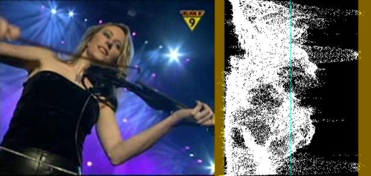
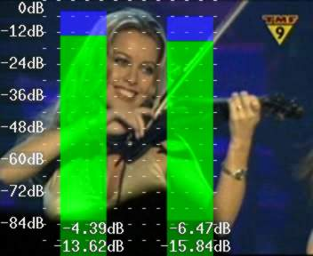

Histogram
=========

``Histogram`` (clip, string ''mode''[, float ''factor''])

Adds a luminance histogram to the right side of the clip.

Starting from AviSynth *v2.50* this filter will also show valid and invalid
colors in YUV mode. Invalid values (below 16 and above 235) will be colored
brown/yellow-ish.

Starting in *v2.53* an optional mode parameter has been added to show
additional information of a clip. mode can be "Classic" (default old mode),
"Levels", "Color", "Luma" (*v2.54*), "Stereo" (*v2.54*), "StereoOverlay"
(*v2.54*), "Color2"  (*v2.58*), "AudioLevels" (*v2.58*) and "Stereo"
(*v2.60*). Since *v2.60* an optional factor parameter is added which can be
used for the mode "levels".

Classic mode
------------

This will add a per-line luminance graph (which is actually called a Waveform
Monitor) on the right side of the video. the left side of the graph
represents luma = 0 and the right side represents luma = 255. The non-valid
CCIR-601 ranges are shown in a brown/yellow-ish color, and a greenish line
represents Y = 128.

Available in YUV mode.

Levels mode
-----------

.. image:: pictures/histogram_modelevels.jpg

This mode will display three level-graphs on the right side of the video
frame (which are called Histograms). This will show the distribution of the
Y, U and V components in the current frame.

The top graph displays the luma (Y) distribution of the frame, where the left
side represents Y = 0 and the right side represents Y = 255. The valid
CCIR601 range has been indicated by a slightly different color and Y = 128
has been marked with a dotted line. The vertical axis shows the number of
pixels for a given luma (Y) value. The middle graph displays the U component,
and the bottom graph displays the V component.

The factor option (100.0 by default) specifies the way how the graphs are
displayed. It is specified as percentage of the total population (that is
number of luma or chroma pixels in a frame). For example, HistoGram("Levels",
1.5625) will achieve a 1/64th cap.

Available in all planar mode except Y8.

Color mode
----------

.. image:: pictures/histogram_modecolor.jpg

This mode will display the chroma values (U/V color placement) in a two
dimensional graph (which is called a vectorscope) on the right side of the
video frame. It can be used to read of the hue and saturation of a clip. At
the same time it is a histogram. The whiter a pixel in the vectorscope, the
more pixels of the input clip correspond to that pixel (that is the more
pixels have this chroma value).

The U component is displayed on the horizontal (X) axis, with the leftmost
side being U = 0 and the rightmost side being U = 255. The V component is
displayed on the vertical (Y) axis, with the top representing V = 0 and the
bottom representing V = 255.

The position of a white pixel in the graph corresponds to the chroma value of
a pixel of the input clip. So the graph can be used to read of the hue (color
flavor) and the saturation (the dominance of the hue in the color). As the
hue of a color changes, it moves around the square. At the center of the
square, the saturation is zero, which means that the corresponding pixel has
no color. If you increase the amount of a specific color, while leaving the
other colors unchanged, the saturation increases, and you move towards the
edge of the square.

Available in all planar mode except Y8.

Color2 mode
-----------

.. image:: pictures/histogram_modecolor2.jpg

This mode will display the pixels in a two dimensional graph (which is called
a vectorscope) on the right side of the video frame. It can be used to read
of the hue and saturation of a clip.

The U component is displayed on the horizontal (X) axis, with the leftmost
side being U = 0 and the rightmost side being U = 255. The V component is
displayed on the vertical (Y) axis, with the top representing V = 0 and the
bottom representing V = 255. The grey square denotes the valid CCIR601 range.

The position of a pixel in the graph corresponds to the chroma value of a
pixel of the input clip. So the graph can be used to read of the hue (color
flavor) and the saturation (the dominance of the hue in the color). As the
hue of a color changes, it moves around the circle. At the center of the
circle, the saturation is zero, which means that the corresponding pixel has
no color. If you increase the amount of a specific color, while leaving the
other colors unchanged, the saturation increases, and you move towards the
edge of the circle. A color wheel is plotted and divided into six hues (red,
yellow, green, cyan, blue and magenta) to help you reading of the hue values.
Also every 15 degrees a white dot is plotted.

At U=255, V=128 the hue is zero (which corresponds to blue) and the
saturation is maximal, that is, sqrt( (U-128)^2 + (V-128)^2 ) = 127. When
turning clock-wise, say 90 degrees, the chroma is given by U=128, V=255
(which corresponds to red). Keeping the hue constant and decreasing the
saturation, means that we move from the circle to the center of the
vectorscope. Thus te color flavor remains the same (namely red), only it
changes slowly to greyscale.  Etc ...

Available in all planar mode except Y8.

Luma mode
---------

.. image:: pictures/histogram_modeluma.jpg

This mode will amplify luminance, and display very small luminance
variations. This is good for detecting blocking and noise, and can be helpful
at adjusting filter parameters. In this mode a 1 pixel luminance difference
will show as a 16 pixel luminance pixel, thus seriously enhancing small
flaws.

Available in planar and YUY2 modes.

Stereo, StereoY8 and StereoOverlay mode
---------------------------------------

.. image:: pictures/histogram_modestereo.gif

This mode shows a classic stereo graph, from the audio in the clip. Some may
know these from recording studios. This can be used to see the left-right and
phase distribution of the input signal. StereoOverlay will overlay the graph
on top of the original. Each frame will contain only information from the
current frame to the beginning of the next frame. The signal is linearly
upsampled 8x, to provide clearer visuals. Stereo and StereoY8 won't overlay
the graph on the video, but will just return the graph (in YV12 respectively
Y8 format).

This mode requires a stereo signal input and StereoOverlay requires YV12
video.

AudioLevels mode
----------------

This mode shows the audiolevels for each channel in decibels (multichannel is
supported). More accurately it determines:

-   the root mean square value of the samples belonging to each frame and
    converts this value to decibels using the following formula:

RMS = 20 * log_10( sqrt( sum_j( sample(j)^2 ) / j ) / 32768 )  # for each
channel

-   the maximum volume of the samples belonging to each frame and
    converts this value to decibels using the following formula:

max = 20 * log_10( max_j( sample(j) ) / 32768 )  # for each channel

The bars corresponding to the root mean square value are green, and to the
maximum are blue. The filter is available in planar mode and the audio is
converted to 16 bit. Note that for 16 bit audio, the maximal volume could be

20 * log_10(32768/32768) = 0 dB (since 2^16/2 = 32768)

and the minimal volume

20 * log_10(1/32768) = - 90.31 dB

+---------+-----------------------------------------------------+
| Changes |                                                     |
+=========+=====================================================+
| v2.53   | Added different modes.                              |
+---------+-----------------------------------------------------+
| v2.55   | Added dots to mode = "stereo" to show bias/offsets. |
+---------+-----------------------------------------------------+
| v2.56   | Added invalid colors in YUY2 mode.                  |
+---------+-----------------------------------------------------+
| v2.58   | Color2 and AudioLevels modes added.                 |
+---------+-----------------------------------------------------+
| v2.58   | Added planar support.                               |
+---------+-----------------------------------------------------+
| v2.60   | Added StereoY8 mode. Added factor option.           |
+---------+-----------------------------------------------------+

$Date: 2011/04/29 20:09:50 $
