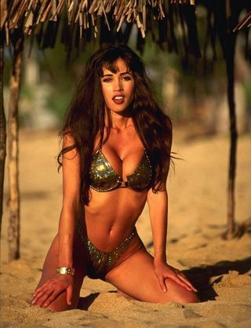
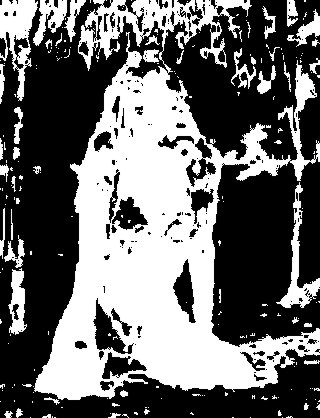

MaskHS
======

``MaskHS`` (clip, float "startHue", float "endHue", float "maxSat", float
"minSat", bool "coring")

Added in *v2.6*. This filter returns a mask (as Y8) of clip using a given hue
and saturation range.

*startHue* (default 0), *endHue* (default 360): (both from 0 to 360; given in
degrees.). The hue and saturation will be adjusted for values in the range
[startHue, endHue] when startHue<endHue. Note that the hue is periodic, thus
a hue of 360 degrees corresponds with a hue of zero degrees. If
endHue<startHue then the range [endHue, 360] and [0, startHue] will be
selected (thus anti-clockwise). If you need to select a range of [350, 370]
for example, you need to specify startHue=370 and endHue=350. Thus when using
the default values all pixels will be processed.

*maxSat* (default 150), *minSat* (default 0): (both from 0 to 150 with
minSat<maxSat; given in percentages). The hue and saturation will be adjusted
for values in the range [minSat, maxSat]. Practically the saturation of a
pixel will be in the range [0,100] (thus 0-100%), since these correspond to
valid RGB pixels (100% corresponds to R=255, G=B=0, which has a saturation of
119). An overshoot (up to 150%) is allowed for non-valid RGB pixels (150%
corresponds to U=V=255, which has a saturation of sqrt(127^2+127^2) = 180).
Thus when using the default values all pixels will be processed.

*coring* = true/false (default false). When set to true, the luma (Y) is
clipped to [16,235]; when set to false, the luma is left untouched.

Suppose we want to create a mask of the skin of the girl. The proper way to
do this is to use look at the vectorscope of :doc:`Histogram <histogram>`:

::

    clip = ...
    Histogram(clip, mode="color2")

and estimate the hue range you want to select. As can be seen, the orange hue
is between (about) 105 and 165 degrees.

lower the hue range till you found the correct hue range which should be
processed. Use the values in ``MaskHS`` and make the interval smaller till
the correct one is selected. You can also use :doc:`Tweak <tweak>` for this (with
sat=0). Using the example in Tweak, the following mask is obtained:

original MaskHS(startHue=105, endHue=138)

Looking at the blue screen example in :doc:`Overlay <overlay>` the following can be used
::

    testcard = ColorBars()

    # example subtitle file with blue background:
    subs = ImageSource("F:\TestClips\blue.jpg").ConvertToYV24

    # subs.Histogram(mode="color2").ConvertToRGB
    # blue in [345,359]
    mask_hs = subs.MaskHS(startHue=340, endHue=359).Levels(0, 1, 255, 255, 0)

    Overlay(testcard, subs, mask=mask_hs, mode="blend", opacity=1)

+-----------+-----------------+
| Changelog |                 |
+===========+=================+
| v2.60     | Initial Release |
+-----------+-----------------+

$Date: 2011/04/29 20:09:50 $
