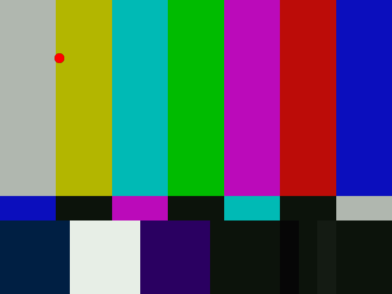

Overlay
=======

``Overlay`` (clip, clip overlay, int "x", int "y", clip "mask", float
"opacity", string "mode", bool "greymask", string "output", bool
"ignore_conditional", bool "pc_range")

``Overlay`` puts two clips on top of each other with an optional displacement
of the overlaying image, and using different overlay methods. Furthermore
opacity can be adjusted for the overlay clip.

Input for overlay is any colorspace, and colorspaces of different clip
doesn't matter! The input clips are internally converted to a general YUV
(with no chroma subsampling) format, so it is possible for the filter to
output another colorspace than the input. It is also possible to input video
in different colorspaces, as they will be converted seamlessly. It is however
not recommended to use overlay "only" for colorspace conversions, as it is
both slower and with slightly worse quality.

In general all clips are treated as 0->255 values. This means that numbers
will not be clipped at CCIR 601 range. Use :doc:`Limiter <limiter>` for this task
afterwards.

**Masks should also have values from 0->255.** You can use
:doc:`Histogram <histogram>` in ``Histogram("levels")`` mode to view the color
distributions. If your mask is in CCIR 601 range, use
`ColorYUV(levels="TV->PC")` to upscale the color levels.

It is not recommended to do overlays on interlaced material, unless you know
what you are doing.

Parameters
----------

| **clip**
| This clip will be the base, and the overlay picture will be placed on top of
  this.

| **overlay**
| This is the image that will be placed on top of the base clip. The colorspace
  or image dimensions do not have to match the base clip.

| **x & y**
| These two variables define the placement of the overlay image on the base
  clip in pixels. The variable can be positive or negative.
|  *Default values are 0.*

| **mask**
| This will be used as the transparency mask for the overlay image. The mask
  must be the same size as the overlay clip. By default only the greyscale
  (luma) components are used from the image. The darker the image is, the more
  transparent will the overlay image be.
|  *There is no default, but not specitying is equivalent to supplying a 255
  clip.*

| **opacity**
| This will set how transparent your image will be. The value is from 0.0 to
  1.0, where 0.0 is transparent and 1.0 is fully opague (if no mask is used).
  When used together with a mask this value is multiplied by the mask value to
  form the final opacity.
|  *Default value is 1.0*

| **mode**
| Mode defines how your clip should be overlaid on your image.

+------------+-------------------------------------------------------------------------------------------------------+
| Mode       | Description                                                                                           |
+============+=======================================================================================================+
| Blend      | This is the default mode. When opacity is 1.0 and there is no mask the                                |
|            | overlay image will be copied on top of the original. Ordinary transparent blending is used otherwise. |
+------------+-------------------------------------------------------------------------------------------------------+
| Add        | This will add the overlay video to the base video, making the video                                   |
|            | brighter. To make this as comparable to RGB, overbright luma areas are                                |
|            | influencing chroma and making them more white.                                                        |
+------------+-------------------------------------------------------------------------------------------------------+
| Subtract   | The opposite of Add. This will make the areas darker.                                                 |
+------------+-------------------------------------------------------------------------------------------------------+
| Multiply   | This will also darken the image, but it works different than subtract.                                |
+------------+-------------------------------------------------------------------------------------------------------+
| Chroma     | This will only overlay the color information of the overlay clip on to the base image.                |
+------------+-------------------------------------------------------------------------------------------------------+
| Luma       | This will only overlay the luminosity information of the overlay clip on to the base image.           |
+------------+-------------------------------------------------------------------------------------------------------+
| Lighten    | This will copy the light infomation from the overlay clip to the base                                 |
|            | clip, only if the overlay is lighter than the base image.                                             |
+------------+-------------------------------------------------------------------------------------------------------+
| Darken     | This will copy the light infomation from the overlay clip to the base                                 |
|            | clip, only if the overlay is darker than the base image.                                              |
+------------+-------------------------------------------------------------------------------------------------------+
| SoftLight  | This will ligten or darken the base clip, based on the light level                                    |
|            | of the overlay clip. If the overlay is darker than luma = 128, the base image                         |
|            | will be darker. If the overlay is lighter than luma=128, the base image will                          |
|            | be lighter. This is useful for adding shadows to an image. Painting with pure                         |
|            | black or white produces a distinctly darker or lighter area but does not                              |
|            | result in pure black or white.                                                                        |
+------------+-------------------------------------------------------------------------------------------------------+
| HardLight  | This will ligten or darken the base clip, based on the light level                                    |
|            | of the overlay clip. If the overlay is darker than luma = 128, the base image                         |
|            | will be darker. If the overlay is lighter than luma=128, the base image will                          |
|            | be lighter. This is useful for adding shadows to an image. Painting with pure                         |
|            | black or white results in pure black or white.                                                        |
+------------+-------------------------------------------------------------------------------------------------------+
| Difference | This will display the difference between the clip and the overlay.                                    |
|            | Note that like :doc:`Subtract <subtract>` a difference of zero is displayed as grey, but              |
|            | with luma=128 instead of 126. If you want the pure difference, use                                    |
|            | mode="Subract" or add `ColorYUV(off_y=-128)`.                                                         |
+------------+-------------------------------------------------------------------------------------------------------+
| Exclusion  | This will invert the image based on the luminosity of the overlay                                     |
|            | image. Blending with white inverts the base color values; blending with black                         |
|            | produces no change.                                                                                   |
+------------+-------------------------------------------------------------------------------------------------------+

*Default value is Blend*

| **greymask**
| This option specifies whether chroma from the mask should be used for chroma
  transparency. For general purpose this mode shouldn't be disabled. External
  filters like mSharpen and Masktools are able to export proper chroma maps.
|  *Default value is true*

| **output**
| It is possible to make Overlay return another colorspace. Possible output
  colorspaces are &quotYUY2", "YV12", "RGB32" and "RGB24".
|  *Default is input colorpace*

| **ignore_conditional**
| This will make Overlay ignore any given conditional variables. See the
  "Conditional Variables" section for an overview over conditional variables.
|  *Default is false*

| **pc_range**
| When set to true, this will make all internal RGB -> YUV -> RGB conversions
  assume that luma range is 0 to 255 instead of default 16->235 range. It is
  only recommended to change this setting if you know what you are doing. See
  the section on "RGB considerations" below.
|  *Default is false*

RGB considerations
------------------

This section will describe things that may give you an explanation of why
Overlay behaves like it does when it is given one or more RGB sources.
One or more inputs for Overlay are allowed to be RGB-data. However, as
Overlay is processing material in the YUV colorspace this will lead to an RGB
to YUV conversion. There are two modes for this conversion, toggled by the
"pc_range" parameter. This parameter will extend the YUV range from 16-235
(this is the range used by all avisynth converters) to 0-255. There are some
cases where enabling pc_range is a good idea:

-   When overlaying an RGB-clip using the "add", "subtract" or "multiply"
    modes, the range of the overlay clip is better, if it is 0-255, since
    this will enable completely dark areas not to influence the result
    (instead of adding 16 to every value).
-   When NOT doing a colorspace conversion on output. If the output
    colorspace (RGB vs. YUV) is different from the input, the scale will be
    wrong. If pc_range is true, and input is RGB, while output is YUY2 - the
    YUY2 will have an invalid range, and not CCIR 601 range.

**Outputting RGB**

It might be a good idea to let Overlay output YUY2, even if your input
colorspace is RGB, as this avoids a colorspace conversion back to RGB from
YUV. You should however be aware that your material might be "overscaled", as
mentioned above, if you use pc_range = true. You can correct this by using
''ColorYUV(levels="pc->tv")'' to convert back to 16-235 range.

**Inputting RGB for mask clip**

The mask clip from RGB may behave a bit different than it could be expected.
If you always use a greyscale mask, and don't disable "greymask" you will get
the result you'd expect. You should note that mask clip values are never
scaled, so it will automatically be in 0->255 range, directly copied from the
RGB values.

**Using RGB32 alpha channel**

Overlay will never use the alpha channel given in an RGB32 clip. If you want
to extract the alpha channel from an RGB32 clip you can use the
:doc:`ShowAlpha <showalpha>` command to extract the alpha information. For maintaining
maximum quality it is recommended to extract the alpha as RGB.

Conditional Variables
---------------------

The global variables "*OL_opacity_offset*", "*OL_x_offset*" and
"*OL_y_offset*" are read each frame, and applied. It is possible to modify
these variables using :doc:`FrameEvaluate <conditionalfilter>`. The values of these variables
will be added to the original on each frame. So if you specify "x = 100" as a
filter parameter, and the global variable "*OL_x_offset*" is set to 50, the
overlay will be placed at x = 150.

If you are using multiple filters this can be disabled by using the
"ignore_conditional = true" parameter.

There is an example of conditional modification at the
:doc:`ConditionalReader <conditionalreader>` page.

Examples
--------

- Prepares some sources.

::

    bg = colorbars(512,384).converttoyuy2()
    text = blankclip(bg).subtitle("Colorbars", size=92,
    text_color=$ffffff).coloryuv(levels="tv->pc")

- This will overlay the text in three different versions.

::

    overlay(bg, text, x=50, y=20, mode="subtract", opacity=0.25)
    overlay(text, x=50, y=120, mode="add", opacity=0.5)
    overlay(text, x=50, y=240, mode="blend", opacity=0.7)

- This will overlay yuy2clip with rgbclip using a yuy2-mask (note that the
  luma range of the mask is [0-255]).

::

    Overlay(yuy2clip, rgbclip, mask = rgbclip.ShowAlpha("yuy2"))

- which is the same as

::

    mask = rgbclip.ShowAlpha("rgb").ConvertToYUY2.ColorYUV(levels="TV->PC")
    Overlay(yuy2clip, rgbclip, mask)

- which is the same as

::

    mask = rgbclip.ShowAlpha("rgb")
    Overlay(yuy2clip, rgbclip, mask)

- This will take the average of two clips. It can be used for example to
  combine two captures of different broadcastings for reducing noise. A
  discussion of this idea can be found [`here`_]. A sample script (of course
  you have to ensure that the frames of the two clips matches exactly, use
  :doc:`DeleteFrame <deleteframe>` if necessary):

::

    clip1 = AviSource("F:\shakira-underneath_your_clothes1.avi")
    clip2 = AviSource("F:\shakira-underneath_your_clothes2.avi")
    Overlay(clip1, clip2, mode="blend", opacity=0.5)

- Use a blue (or any other color) background (blue.jpg is a blue frame
  overlaid with subtitles in a black rectangle) as mask. The black rectangle
  containing the subtitles will be visible on the source clip (which is
  ColorBars here):

::

    testcard = ColorBars()

    # get a blue mask clip (the same blue as in ColorBars is used: R16 G16 B180)
    maskclip = BlankClip(testcard, color=$0f0fb4)

    # Example subtitle file with blue backgroud as above
    subs = ImageSource("F:\TestClips\blue.jpg").ConvertToRGB32

    maskclip = ColorKeyMask(subs, $0f0fb4, 60)

    Overlay(testcard, subs, mask=ShowAlpha(maskclip), mode="blend", opacity=1)

.. image:: pictures/overlay_blue.jpg
.. image:: pictures/overlay_subs.png

A tolerance of 60 is used here because the blue is not entirely uniform. Near
the black rectangles the blue is given by R23 G22 B124. Probably due to the
compression of blue.jpg.

# Move a red (or any other color) dot on a clip using ConditionalReader
(dot.bmp is a red dot on a black background):

::

    a1 = ColorBars().Trim(0,399)
    a2 = ImageSource("F:\TestClips\dot.bmp").ConvertToRGB32

    # a2.GreyScale returns a grey dot on a black background; Levels makes the dot white
    mask_clip = Mask(a2, a2.GreyScale.Levels(0, 1, 75, 0, 255))
    Overlay(a1, a2, mask=ShowAlpha(mask_clip), y=0, x=0, mode="blend", opacity=1)

    ConditionalReader("xoffset.txt", "ol_x_offset", false)
    ConditionalReader("yoffset.txt", "ol_y_offset", false)

Make xoffset.txt containing the x-positions and yoffset.txt containing the
y-positions of the moving dot (see :doc:`ConditionalReader <conditionalreader>` for more info), and
put it in the same folder as your script:

::

    xoffset.txt

    Type int
    Default -50

    R 0 100 20
    I 100 200 20 250
    R 200 300 250
    I 300 400 250 400 ::yoffset.txt

    Type int
    Default -50

    R 0 100 20
    I 100 200 20 350
    R 200 300 350
    I 300 400 350 40

.. image:: pictures/overlay_dot.png

thus the dot moves in the following way: (20,20) -> (250,350) -> (400,40).
Nb, it's also possible to do this with Animate.

+-----------+-----------------+
| Changelog |                 |
+===========+=================+
| v2.54     | Initial Release |
+-----------+-----------------+

$Date: 2011/04/29 20:09:50 $

.. _here: http://forum.doom9.org/showthread.php?s=&threadid=28438
