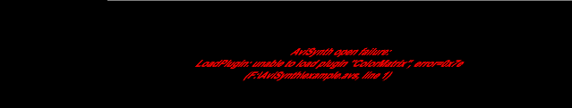
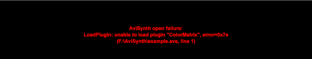

SkewRows
========

``SkewRows`` (int skew)

``SkewRows`` (added in *v2.60*) skews the rows of a clip by an amount of
*skew*. The skewing is memory layout based, so RGB images are skewed from the
bottom up, YUV images are skewed from the top down.

It can be used to read those skewed error messages that some media player
users are submitting.

The effect of the algorithm is to paste all of the input rows together as one
single very long row, then slice them up based on the new width (= input
width + skew). Skew can also be negative in which case the last skew pixels
of each line are added to the beginning of the next line and you get some
extra lines at the end. The last line is padded with grey pixels when
required.

The geometry of the output is calculated as follows:

-   OutWidth = InWidth + skew // signed skew values acceptable
-   OutHeight = (InHeight*InWidth + OutWidth-1) / OutWidth // rounded up
    to nearest integer

All interleaved pixel formats are supported (including Y8), though *skew*
should be even for YUY2.

**examples:**

Original SkewRows(1)

+-----------+-----------------+
| Changelog |                 |
+===========+=================+
| v2.60     | Initial release |
+-----------+-----------------+

$Date: 2011/01/16 12:22:43 $
