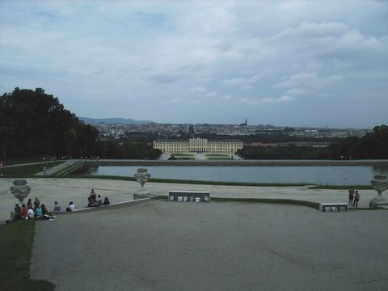
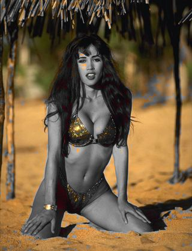

Tweak
=====

``Tweak`` (clip, float "hue", float "sat", float "bright", float "cont", bool
"coring", bool "sse", float "startHue", float "endHue", float "maxSat", float
"minSat", float "interp", bool "dither")

This function provides the means to adjust the hue, saturation, brightness,
and contrast of a video clip. In *v2.58*, both the saturation and hue can be
adjusted for saturations in the range [minSat, maxSat] and hues in the range
[startHue, endHue]. interp interpolates the adjusted saturation to prevent
banding.

*Hue*: (-180.0 to +180.0, default 0.0) is used to adjust the color hue of the
image. Positive values shift the image towards red. Negative values shift it
towards green.

*Sat*: (0.0 to 10.0, default 1.0) is used to adjust the color saturation of the
image. Values above 1.0 increase the saturation. Values below 1.0 reduce the
saturation. Use sat=0 to convert to grayscale.

*Bright*: (-255.0 to 255.0, default 0.0) is used to change the brightness of
the image. Positive values increase the brightness. Negative values decrease
the brightness.

*Cont*: (0.0 to 10.0, default 1.0) is used to change the contrast of the image.
Values above 1.0 increase the contrast. Values below 1.0 decrease the
contrast.

*coring* = true/false (optional; true by default, which reflects the
behaviour in older versions) is added. When setting to true is means that the
luma (Y) is clipped to [16,235] and the chroma (U, V) is clipped to [16,240],
and when setting to false it means that the luma and chroma are
unconstrained. [Added in *v2.53*.]

*sse* = true/false (default false) is only available for YUY2 with coring=false
and only using the standard *hue*, *sat*, *bright* and *cont* options. It re-
enables the SSE code if required. [reAdded in *v2.60*.]

*startHue* (default 0), endHue (default 360): (both from 0 to 360; given in
degrees.). The hue and saturation will be adjusted for values in the range
[startHue, endHue] when startHue<endHue. Note that the hue is periodic, thus
a hue of 360 degrees corresponds with a hue of zero degrees. If
endHue<startHue then the range [endHue, 360] and [0, startHue] will be
selected (thus anti-clockwise). If you need to select a range of [350, 370]
for example, you need to specify startHue=350 and endHue=10 (370-360). Thus
when using the default values all pixels will be processed.

*maxSat* (default 150), minSat (default 0): (both from 0 to 150 with
minSat<maxSat; given in percentages). The hue and saturation will be adjusted
for values in the range [minSat, maxSat]. Practically the saturation of a
pixel will be in the range [0,100] (thus 0-100%), since these correspond to
valid RGB pixels (100% corresponds to R=255, G=B=0, which has a saturation of
119). An overshoot (up to 150%) is allowed for non-valid RGB pixels (150%
corresponds to U=V=255, which has a saturation of sqrt(127^2+127^2) = 180).
Thus when using the default values all pixels will be processed.

*interp*: (0 to 32, default 16; given in units of chroma, rather than a
percentage) is used to interpolate the saturation adjustment at the edges of
the chosen range. The adjustment is interpolated between 1.0 and sat in the
range [*minS*-interp, *minS*] and between sat and 1.0 in [*maxS*,
*maxS*+interp], where *minS* and *maxS* are the equivalents of minSat and
maxSat in chroma units (100% = 119 units). There is no interpolation for
interp=0, which can be useful when a clip consists of uniform colors and you
want a hard cutoff. The interpolation is linear.

*dither* = true/false (false by default): When set to true, `ordered
dithering`_ is applied when doing the adjustment.

Usage and examples: adjusting contrast and brightness
-----------------------------------------------------

original

There are two problems with this picture. It is too dark, and the contrast is
too small (the details of the tree are not visible for example). First, we
will increase the brightness to make the picture less dark (left picture
below). Second, we will increase the contrast to make details in the dark
areas more visible (right picture below). Make sure that the bright parts
don't get to0 bright though.

.. image:: pictures/tweak_bright20_cont12.jpg

bright=20 bright=20, cont=1.2

Usage and examples: adjusting saturation
----------------------------------------

.. image:: pictures/tweak_original2.jpg
.. image:: pictures/tweak_sat075.jpg

original sat=0.75

Suppose we want to lower the saturation of the skin of the girl, and the
background should be left intact. The proper way to do this is to set sat=0,
and lower the hue range till you found the correct hue range which should be
processed. This can be done by using a Vectorscope, but also manually. (If it
is needed the saturation range can also be specified if the dark and white
parts of that hue should not be processed.) The result is below.

.. image:: pictures/tweak_hue105-138_sat075.jpg

sat=0, startHue=105, endHue=138 sat=0.75, startHue=105, endHue=138

Instead, we can also try to "select" the skin of the girl by narrowing the
saturation range only. The result is below. In this case the result is pretty
much identical.

.. image:: pictures/tweak_sat70-50.jpg
.. image:: pictures/tweak_sat70-50_sat075.jpg

sat=0, maxSat=75, minSat=55 sat=0.75, maxSat=75, minSat=55

+-----------+---------------------------------------------------+
| Changelog |                                                   |
+===========+===================================================+
| v2.60     | added sse=true/false to enable sse code           |
+-----------+---------------------------------------------------+
| v2.58     | added startHue, endHue, maxSat, minSat and interp |
+-----------+---------------------------------------------------+

$Date: 2011/12/04 15:28:44 $

.. _ordered dithering: http://avisynth.org/mediawiki/Ordered_dithering
